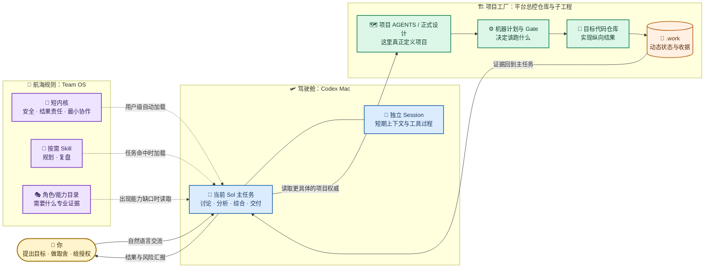
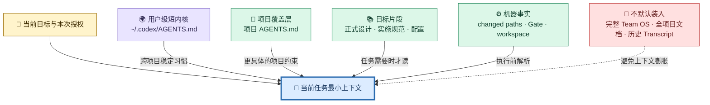
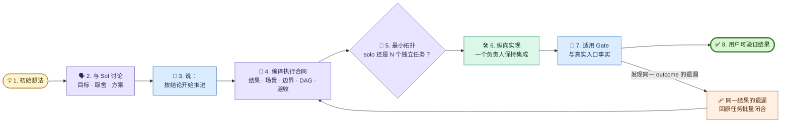
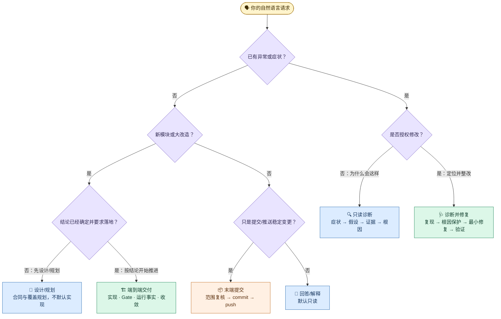
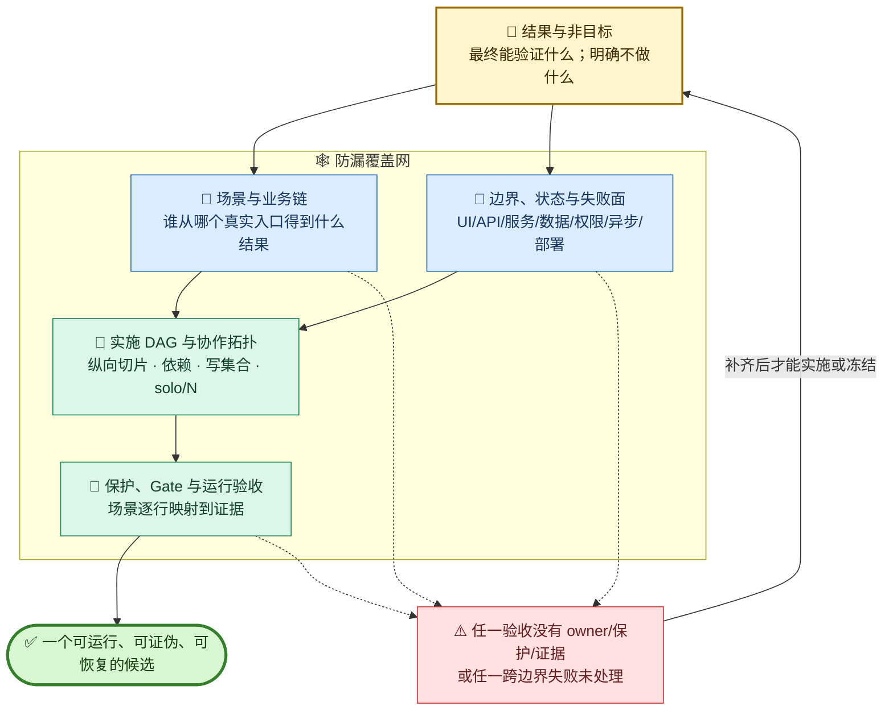
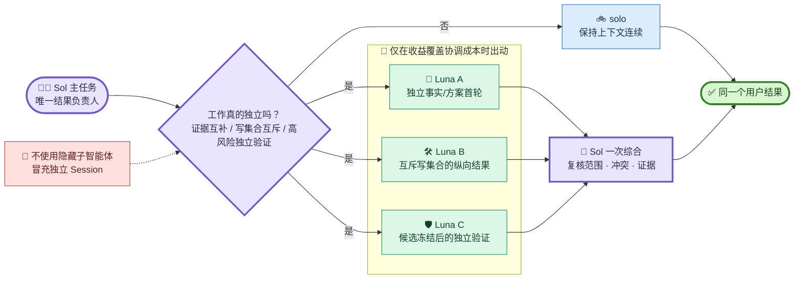
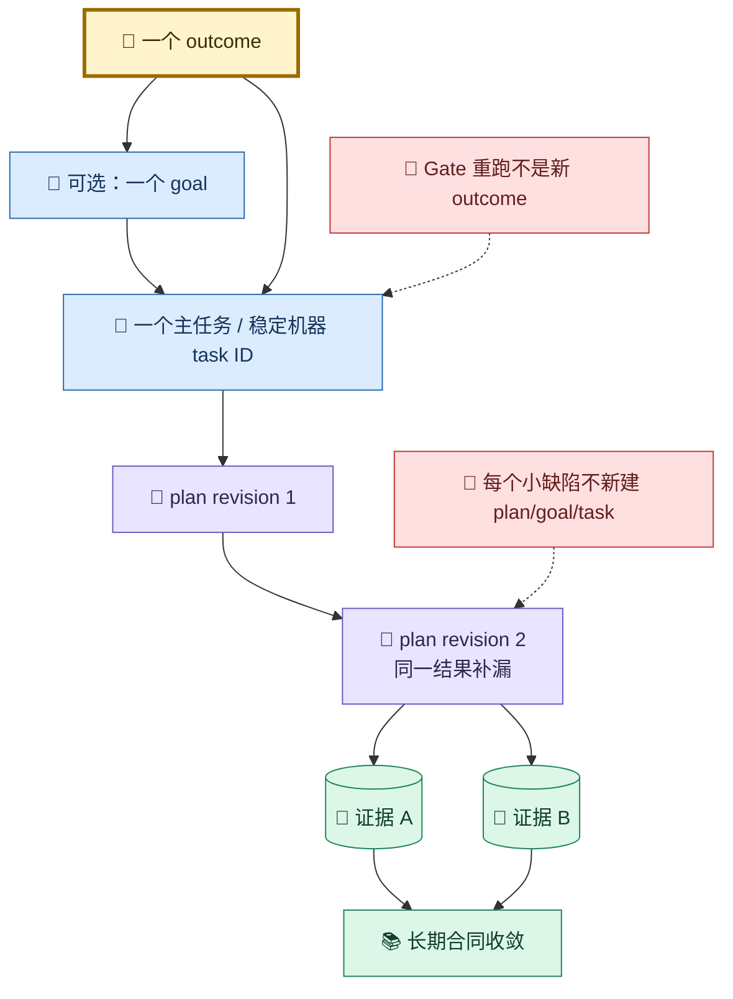
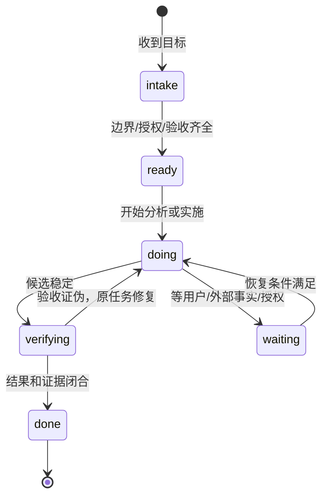

# Codex + Team OS 日常工作流使用手册

> 面向长期日常使用的入口手册。它解释“怎么用、为什么这样工作、事实在哪里”，不替代项目自己的 `AGENTS.md`、正式设计、机器 Gate 或生产合同。

## 1. 先用一句话理解整套系统

你仍然只在 **Codex Mac 客户端**里工作：先和当前 Sol 主任务讨论，满意后说“按结论开始推进”。Team OS 在背后提供跨项目稳定的协作方法，目标项目则提供业务事实、代码、Gate 和运行边界。



三个容易混淆的边界：

| 系统 | 它拥有的东西 | 它不拥有的东西 |
| --- | --- | --- |
| Codex Mac | 任务、Session、模型、工具、权限和交互体验 | 项目长期业务事实 |
| Team OS | 跨项目稳定的方法、协作拓扑、角色能力、用户级短内核 | 某个平台的服务清单、Gate、生产事实和运行流水 |
| 项目总控仓库 | 项目业务、子工程索引、正式设计、机器计划、Gate 和生产边界 | 跨项目通用工作方法 |

因此，采用 Team OS **不会替换 Codex 客户端**，也不会要求先运行 Munder。Munder 若以后恢复，只是另一种可视化入口。

## 2. 规则是怎样进入当前任务的

规则不是一次性把所有文档塞进 Prompt，而是像“逐层展开地图”一样按需加载：



| 载体 | 何时加载 | 保存什么 |
| --- | --- | --- |
| `~/.codex/AGENTS.md` | Codex 发现用户级指令时 | Team OS 七条短内核 |
| 项目 `AGENTS.md` | 进入对应项目作用域时 | 项目安全红线、权威路由和机器入口 |
| `team-os-plan` | “按结论开始推进”、复杂模块、跨仓规划等命中时 | 结果合同、覆盖规划和最小协作拓扑的方法 |
| 项目流程 Skill | 意图命中时 | 诊断、设计、交付、评审、提交等唯一流程 |
| 正式设计/配置 | 当前业务链需要时 | 真实产品、架构、路径、Gate 与生产事实 |
| 当前 Session | 工作过程中 | 短期讨论、决策连续性和工具过程 |
| 项目 `.work` | 执行和验证过程中 | 动态计划、状态、收据；不进入长期文档 |

检查 Team OS 用户级投影是否生效：

```bash
cd <team-os-root>
python3 scripts/install_codex.py --check
```

更新用户级投影后，新建一个 Codex 任务可以确保它从起点加载最新版短内核。完整 Team OS 文档不会因此进入每个任务上下文。

## 3. 最常用的主链：讨论完，直接推进

你不需要先填任务卡，也不需要自己拆前端、后端和测试人员。



这条链专门解决三个旧痛点：

1. **不再机械写两份文档。** 稳定语义直接进入正式设计；活动执行只保留一份覆盖型实施规划。
2. **不让 happy path 冒充完整。** 规划必须覆盖场景、失败恢复、跨边界状态、实现 owner 和证据映射。
3. **不把刷新后发现的每个小问题重新立项。** 同一用户结果复用原任务与原规划，集中修正后只生成一个新候选。

## 4. 先说清意图，Codex 才会走对流程



说法的差别会改变授权边界：

| 你说 | 系统应理解为 |
| --- | --- |
| “分析为什么会这样” | 只读定位，不顺手修改 |
| “定位并整改这个问题” | 同一个诊断闭环内完成最小修复和目标验证 |
| “设计/规划这个模块” | 只形成正式设计或实施规划，不默认实现 |
| “按以上结论开始推进” | 读取项目权威后端到端交付 |
| “提交并推送当前稳定变更” | 只做末端范围复核、适用门禁、提交和推送，不重新设计 |

## 5. 大模块为什么只需要一份覆盖型实施规划

覆盖型实施规划不是“步骤清单”，更像一张带消防通道的施工蓝图：每个用户场景必须能找到实现责任、失败处理和验收证据。



完整规划模板见 [`../../templates/module-implementation-plan.md`](../../templates/module-implementation-plan.md)。它只保留当前可执行合同：长期产品语义仍写回目标项目正式设计，动态命令和收据仍留在项目 `.work`。

## 6. 什么时候才真正使用多个 Agent

默认是一个 Sol 主任务端到端负责。文件多、任务大、Agent 空闲都不是并行理由。



需要真实会话协同时，可直接这样说：

> 按结论开始推进。请先显式判断 `solo` 或推荐 N 个独立任务；如确有独立价值，请创建侧栏可见、拥有独立 Session、可单独验收的 GPT-5.6 Luna 任务，禁止使用隐藏子智能体代替。

每个独立任务必须带上：目标、非目标、输入、写集合、禁止修改、验证、时间预算、完成条件和停止条件。Sol 主任务维护 DAG、集成和跨 Lane Gate。

常见拓扑与用途见 [`../../workflows/adaptive-collaboration.md`](../../workflows/adaptive-collaboration.md)。

## 7. Outcome、Goal、任务、Session、规划和收据的关系

把它们想成一次工程交付中的不同物件：

| 名称 | 形象理解 | 正确用法 |
| --- | --- | --- |
| `outcome` | 🎯 要到达的目的地 | 一个用户可独立验证的结果；是最高层交付单位 |
| Codex 任务/Session | 🚙 当前驾驶过程 | 保存短期讨论和工具连续性；同一结果优先继续原任务 |
| Codex `goal` | 🧷 长途任务的续航锚点 | 只有用户明确要求才建立；一个 outcome 一个 goal |
| 项目机器 task ID | 🏷️ 工地工程号 | 同一结果重规划仍沿用；结果改变才换新 ID |
| 覆盖型实施规划 | 📐 当前施工蓝图 | 记录决策基线、覆盖面、DAG 和验收映射 |
| `planRevision` | 📝 蓝图修订版 | 同一 outcome 的补漏和重规划，不是新项目 |
| Gate 收据 | 🧾 材料/验收证明 | 输入、环境和目标身份相同才可复用；放项目 `.work` |
| 正式设计 | 📚 建成后的长期图纸 | 保存当前长期合同，不保存本次流水和 pass/fail |



## 8. 日常应该打开哪个工作区

| 你要做的事 | 推荐打开位置 | 原因 |
| --- | --- | --- |
| 聚算平台跨服务设计、实施或生产工作 | `jusuan-installer` 平台总控仓库 | 它拥有平台 AGENTS、正式设计、机器 Gate、生产合同和子工程清单 |
| 聚算某个边界清楚的局部代码任务 | 可直接打开目标子工程；跨服务时仍回总控仓库 | 减少上下文，但不能丢失跨服务权威 |
| 新的、完全独立的平台 | 为该平台建立自己的总控仓库 | 不把聚算事实升维成所有平台的事实 |
| 单一小型独立仓库 | 直接打开该仓库 | 它自己维护最小项目覆盖层即可 |
| 修改通用工作方法、角色或 Codex 投影 | `team-os` | 这里才是跨项目 workflow 源 |

Team OS 只登记**平台总控仓库**，不逐个登记平台中的几十个服务。聚算平台的服务仓库仍由 `<jusuan-installer>/.agents/config/workspaces.json` 统一维护；Team OS 的适配器只指向这个权威入口，见 [`../../projects/adapters/jusuan-installer.yaml`](../../projects/adapters/jusuan-installer.yaml)。

`cwd` 是项目指令发现和命令启动锚点，不是权限围墙。Agent 在 Codex 权限、用户授权和任务合同允许时可以访问其他目录；但它仍必须遵守本次明确的写集合，不能因为“能访问”就扩大修改范围。

## 9. 可直接复制的日常说法

### 9.1 先讨论，不实施

> 先只和我讨论分析这个想法，不修改文件。请从用户价值、业务链、失败面和少量方案取舍帮我把结论想清楚。

### 9.2 只设计和规划一个新模块

> 基于刚才的结论设计并规划这个模块。请读取项目权威，只维护必要的正式设计和一份覆盖型实施规划；先不要开始实现。

### 9.3 讨论满意后直接推进

> 按以上结论开始推进。请读取项目 `AGENTS.md`、实施规范、相关正式设计和机器入口，把结论收敛为一个结果合同和一份覆盖型实施规划，显式判断 `solo` 或 N 个独立任务，然后端到端完成实现、适用 Gate、真实入口事实和必要文档收敛。

如果希望明确启用真实 Luna 会话协同，再补一句：

> 如确有独立价值，请直接创建侧栏可见的 GPT-5.6 Luna 独立任务；每个任务须有互斥写集合或独立证据并可单独验收，禁止隐藏子智能体。

### 9.4 只排查原因

> 只读排查这个现象。先给出精确症状和可证伪假设，用最小反馈环定位根因；不要修改实现。

### 9.5 定位并修复一个问题

> 定位并整改这个问题。在同一个诊断闭环中完成复现、根因保护、最小修复和目标验证；不要把相邻问题扩大进来。

### 9.6 继续同一个模块

> 继续推进原 outcome。把这批遗漏合并回原任务和原实施规划 revision，本地集中闭合后再形成一个稳定候选，不为每个小问题新建 goal 或顶层任务。

### 9.7 查看状态

> 汇报当前 outcome、所处状态、首个判别事实、已闭合证据、剩余风险、下一步和停止条件。

### 9.8 提交与推送

> 仅对当前已稳定且属于本任务的变更做范围复核，运行适用末端检查，然后分别提交并推送；不要借提交任务重新设计或带入无关改动。

提交、远端写、生产写、破坏性操作和数据删除不会因为“开始推进”而自动获得授权，仍须在当前请求中明确覆盖。

## 10. Skill 是自动触发，还是需要主动点名

两种方式都支持：**通常靠意图自动命中；关键任务可显式点名以消除歧义。**

| Skill 类型 | 平时怎么触发 | 何时建议显式点名 |
| --- | --- | --- |
| Team OS 规划叠加层 | 说“按结论开始推进”、复杂模块、跨仓结果、需要 DAG/协同时，应命中 `team-os-plan` | 关键大模块可说“使用 `$team-os-plan` 收敛后推进” |
| Team OS 复盘 | 明显返工、意外失败、首次使用新拓扑，或用户要求复盘时命中 | 想把一次经历转成可复用改进时说“使用 `$team-os-retrospective` 复盘” |
| 项目流程所有者 | 根据“只读诊断 / 设计 / 实施 / 评审 / 提交”等意图选择一个 | 请求同时含多种动词、边界可能混淆时可点名 |
| 领域叠加层 | UI、代码结构、离线资产等真实领域命中时加载 | 有特别高的领域风险或验收要求时 |
| 执行器 | 由流程 owner 按机器计划调用 Gate、smoke、refresh、生产事实 | 日常不需要用户逐个点名 |

最重要的不是记住所有 Skill 名称，而是把意图说清。一个任务只应有一个流程所有者；领域 Skill 只补约束，执行器只执行已经确定的目标。

## 11. 聚算平台的机器状态怎么看

以下命令只属于 `jusuan-installer` 项目覆盖层，Team OS 不复制它们的实现合同：

| 命令 | 用途 |
| --- | --- |
| `./juspctl plan ...` | 根据 outcome、changed paths、lane 和目标生成机器计划 |
| `./juspctl tasks` | 查看当前项目任务列表 |
| `./juspctl show --task <task-id>` | 查看一个结果的计划 revision 和状态 |
| `./juspctl close ...` | 只有用户结果、适用证据和运行事实闭合后才关闭 |
| `./juspctl health` | 只读查看任务、Gate 收据和重复执行浪费，不运行测试也不改状态 |

通常由当前 Codex 结果负责人代为运行。完整参数和边界只读 `<jusuan-installer>/docs/平台开发联调部署规范.md`，不要从本手册猜测生产或远端操作。

## 12. 恢复、中断与新开任务

| 情况 | 推荐动作 |
| --- | --- |
| 同一结果的连续推进 | 继续原 Codex 任务，保留 Session 连续性 |
| 同一结果发现一批遗漏 | 回原规划 revision 集中闭合 |
| 原任务上下文已非常混乱 | 用紧凑交接包新开任务，但沿用同一 outcome 和机器 task ID |
| 真正无关、可独立验收的新结果 | 新建 Codex 任务 |
| 需要互补事实或独立验证 | 新建有界独立任务；只共享结果卡和必要权威 |
| 等待用户决定、外部事实或新授权 | 进入 `waiting`，写明等待对象和恢复条件 |

交接包只传：目标与当前状态、已作决策及理由、变更路径、验证与证据引用、剩余风险、下一步和停止条件。不要复制完整 Transcript。



## 13. 常见疑问

### 为什么不默认多 Agent？

多 Agent 会增加上下文交接、等待、冲突和错误放大。只有独立证据、互斥写集合或高风险验证真实存在时，协作才可能比单任务更快、更可靠。

### 角色是不是等于一个固定人物？

不是。角色是责任合同，能力是前端、后端、UX、数据、安全等专业证据，人物只是可选展示，Agent 实例才是本次真实任务/Session。小任务可以由同一主任务顺序切换能力，不必创建多个“员工”。详见 [`../../roles/README.md`](../../roles/README.md)。

### Goal 建了以后是否就代表规划完整？

不代表。Goal 只保证长任务持续推进；完整性来自覆盖规划、项目权威、适用 Gate 和真实入口事实。

### Skill 没有按预期命中怎么办？

先确认请求意图是否明确，再检查用户级投影：

```bash
cd <team-os-root>
python3 scripts/install_codex.py --check
```

关键任务可以直接显式点名 `$team-os-plan`、项目流程 Skill 或验收目标。更新投影后建议从新 Codex 任务验证自动加载。

### 证据为什么有时能复用、有时必须重跑？

只有命令、输入、依赖、环境和动态目标身份都未变化时，成功收据才可复用。源码、构建输入、目标代次或有效时间窗变化时必须重取证据。

### Team OS 会不会让项目离开个人环境后无法运行？

不会。项目必须在未安装个人 Team OS、未运行 Munder 时仍能独立、安全执行。Team OS 是用户级协作增强，不是项目运行依赖。

## 14. 本手册的维护合同

1. 本手册只解释日常入口、心智模型和权威路由；不复制项目 Gate、生产命令或业务正文。
2. 用户操作流程、术语、Codex 投影入口或关键路由改变时更新本手册。
3. 动态 pass/fail、真实 Session ID、日志、密钥和一次性收据不得写入本手册。
4. Mermaid 图与正文表达同一语义；图不能引入正文没有的授权或自动化承诺。
5. 若以后制作可交互 HTML“系统说明书”，它必须从本手册和 Team OS 权威合同生成或引用，只作为可视化投影，不成为第二份手工维护的权威。

进一步理解原理时按需阅读：

- [`../../workflows/conversational-orchestration.md`](../../workflows/conversational-orchestration.md)：对话如何编译成结果合同和 Codex 原生协作；
- [`../../organization/operating-model.md`](../../organization/operating-model.md)：为什么采用单一负责人、独立首轮、WIP 和短复盘；
- [`../../workflows/adaptive-collaboration.md`](../../workflows/adaptive-collaboration.md)：五种最小协作拓扑；
- [`../../codex/README.md`](../../codex/README.md)：哪些内容会安装到 Codex；
- [`../../projects/README.md`](../../projects/README.md)：Team OS 与各平台总控仓库如何分工。
