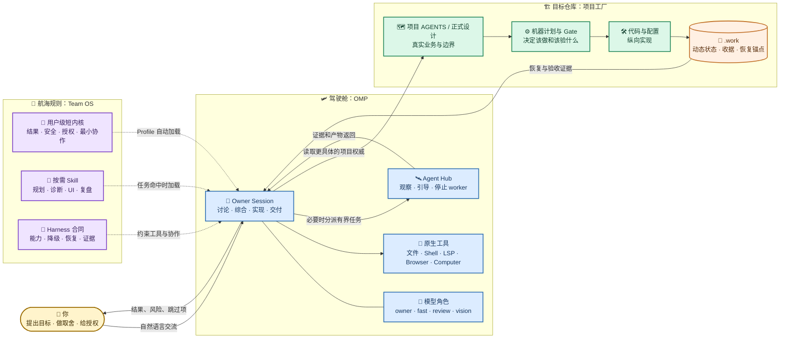
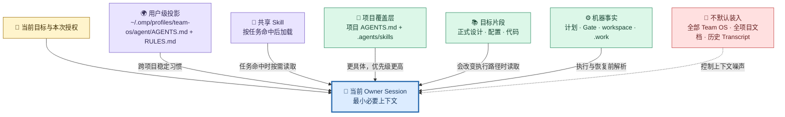
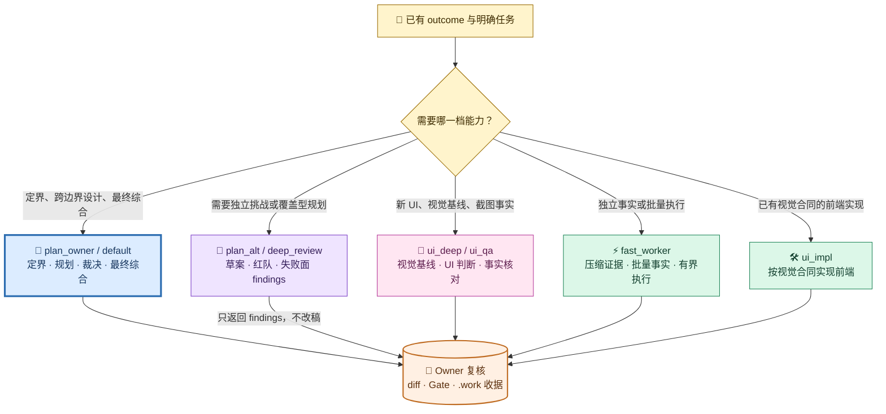
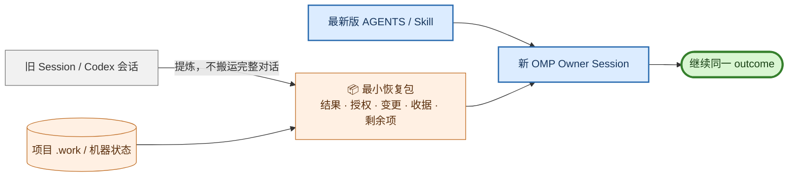

# Pi/OMP + Team OS 工作流原理与日常使用

> 本文只描述长期稳定的工作方法：结果如何定义、规则如何加载、何时协作、怎样交付、怎样恢复和怎样使用模型角色。Provider 登录、钥匙串、模型 selector 和当前配置快照见 [`02-Pi-OMP-Team-OS配置实施记录.md`](./02-Pi-OMP-Team-OS配置实施记录.md)。

## 1. 一句话理解

OMP 是驾驶舱，Team OS 是跨项目工作方法，目标仓库是业务事实和验收的所有者。模型可以替换，Session 可以恢复，worker 可以增减；但同一个用户结果、授权边界、项目事实和有效收据不能因此被重建或丢失。



## 2. 权威和加载顺序

从具体到通用，当前 Session 按以下顺序理解事实：

1. 用户当前目标、授权、非目标和停止条件；
2. 目标项目 `AGENTS.md`、正式设计、机器计划和 Gate；
3. 命中的项目 Skill；
4. Team OS 的 `AGENTS.md`、运行时适配器和命中的共享 Skill；
5. 当前 OMP Profile 的模型、工具和 Session 设置。

Team OS 的长期规则不替代项目事实；模型名不进入角色合同；Session todo、checkpoint 和历史 Transcript 不替代项目 `.work` 或机器状态。

目标明确时直读目标片段，不整份加载无关文档。动态证据落 `.work`，稳定语义才进入 Team OS 正文。



## 3. 先定义结果，再选择拓扑

每个用户结果至少有：

| 字段 | 要回答的问题 |
| --- | --- |
| `outcome` | 用户最终能直接验证什么？ |
| `nonGoals` | 这次明确不做什么？ |
| `authority` | 哪些文档、代码或机器入口拥有事实？ |
| `scope` | 读取、写入和排除范围是什么？ |
| `acceptance` | 通过的具体证据是什么？ |
| `stop` | 失败、等待或越界时何时停止？ |
| `owner` | 谁负责综合、修复和最终报告？ |

一个结果只建立一个顶层任务。Gate、重试、波次、专家输入和 worker 都是该结果的事件或子任务。

意图分类：

- 有症状：走 `diagnose` 的可证伪诊断闭环；
- 方案未定：走 `design`，先收敛决策和边界；
- 结论已定要求实现：走 `deliver-change`；
- 只核对实现：走 `review` 或 `guard`；
- 需要提交：最后才进入 `ship-changes`。

## 4. 角色是职责，不是固定模型

稳定的是能力档位，变化的是运行时绑定：

| 角色 | 职责 |
| --- | --- |
| `plan_owner` / `default` | 结果持有、规划裁决、跨边界设计、最终综合 |
| `plan_alt` | 覆盖型规划草案、失败面矩阵、第二假设 |
| `deep_review` | 独立只读评审、红队 findings、冻结候选挑战 |
| `ui_deep` / `ui_qa` | UI/UX 判断、视觉基线、截图/DOM 事实核对 |
| `fast_worker` | 有界侦察、批量取证、派工包内实现和叶子执行 |
| `ui_impl` | 按视觉合同执行前端实现 |

模型替换不改变上述职责。当前具体模型、fallback 和 Provider 见配置实施记录；第一次分派或映射变化后，在 Agent Hub 核对 resolved model。



## 5. 何时 solo，何时协作

默认 `solo`。只有以下收益足以覆盖上下文和交接成本时才派 worker：

- 不同事实源需要独立首轮；
- 子结果有互斥写集合且能单独验收；
- 高风险候选需要不修改实现的独立验证。

协作约束：

- 一个结果只有一个综合负责人；
- 先定义写集合、禁止读取、验收和停止条件；
- 只读任务可以并行，重叠写入必须串行或保持单一写者；
- worker 不从设计正文反推授权，不越出派工包；
- Owner 必须复核真实 diff、命令输出和收据，不能只采信“完成”。

无独有证据收益的角色、Skill 或 worker 应删除或不启动。

## 6. 日常主链

### 6.1 启动和读取

```bash
cd /path/to/project
omp --profile team-os
```

第一条消息固定结果、非目标、权威、读写范围、验收和停止条件。读取命中的项目规则和目标片段，不先全量扫描。

### 6.2 规划和派工

规划只保留会改变执行路径的决策。复杂跨边界任务才维护覆盖型规划；局部修复用最小计划直接推进。

需要 worker 时，派工包必须包含仓库绝对路径、写集合与禁止修改、目标输入和变更步骤、内联合同、验收命令、停止条件和输出格式。批量读取、命令执行和机械改动通常交 `fast_worker`；规划裁决和最终综合留给 owner。UI 任务先取得视觉基线，再交实现 lane。

### 6.3 实现、验证和收尾

实现失败回到同一负责人修复；同一验收点连续达到失败预算，或根因超出派工包写集合，立即停线并重新定界，不换假设无限重试。

收尾必须闭合：实现合同已满足，适用 Gate 或冒烟已通过，计划要求的运行事实已取得，失败/跳过/授权外边界已披露，动态收据已写入项目 `.work`。

```mermaid
flowchart LR
    TALK["🗣️ 与 Owner 讨论<br/>目标 · 取舍 · 方案"]
    START["🚦 说：按以上结论开始推进"]
    CONTRACT["🎯 编译结果合同<br/>结果 · 非目标 · 授权 · 验收"]
    FACT["🔎 读取最小项目事实<br/>规则 · 代码 · 机器计划"]
    TOPO{"需要独立协作吗？"}
    SOLO["🚲 Owner solo<br/>端到端完成"]
    WORKERS["🚀 task workers<br/>有界输入 · 输出 · 写集合"]
    MERGE["🧩 Owner 综合与集成<br/>复核真实 diff"]
    GATE["🧪 适用 Gate<br/>真实入口与运行事实"]
    RECEIPT[("🧾 .work 收据")]
    DONE(["✅ 一个可验证结果"])
    REPAIR["🩹 同一 outcome 修正<br/>不重新立项"]

    TALK --> START --> CONTRACT --> FACT --> TOPO
    TOPO -->|"否"| SOLO --> GATE
    TOPO -->|"是"| WORKERS --> MERGE --> GATE
    GATE --> RECEIPT --> DONE
    GATE -."普通失败".-> REPAIR --> FACT

    classDef idea fill:#fff4cc,stroke:#9a6b00,color:#3d2b00;
    classDef think fill:#e9e4ff,stroke:#7357c2,color:#2f2850;
    classDef action fill:#dcecff,stroke:#2b6cb0,color:#17365d;
    classDef build fill:#dcf7e8,stroke:#21865a,color:#123f2e;
    classDef done fill:#d9f6d2,stroke:#36802d,color:#173f13,stroke-width:3px;
    classDef repair fill:#fff0e3,stroke:#bf6b21,color:#5a2f0d;
    class TALK,START idea;
    class CONTRACT,TOPO think;
    class FACT,SOLO,WORKERS,MERGE,GATE action;
    class RECEIPT build;
    class DONE done;
    class REPAIR repair;
```



## 7. 可直接使用的话术：短输入，工厂补全

日常不需要填写结果合同。你只说实际想解决、实现或验证的事情，当前 Owner 会读取项目事实并自动补齐意图、范围、角色、验证和停止条件；默认 `@plan_owner`、`solo` 和最短可验证路径。只有产品选择、生产/远端写、删除、凭据或事实冲突才会停下来询问。

完整编译规则见 [`自然语言需求编译工作流`](../../workflows/request-compiler.md)。以下话术只是最短入口，不是必须逐字复制的模板。

### 7.1 日常主入口：直接说需求

```text
<直接描述你要解决、实现或验证的事情>
```

例如：

```text
修复 Console 登录后回到概览页空白，按当前项目规范完成并验证。
```

```text
把模型页面筛选条改成单行，保持现有业务语义并完成适用 UI 验收。
```

```text
分析上传失败的原因，先不要修改代码。
```

### 7.2 少量模式词：只在需要时消除歧义

```text
只分析：<问题>
设计/规划：<目标>
按结论推进：<已经确定的改动>
只验证：<场景或入口>
继续上次任务：<补充要求>
```

没有模式词时，工厂根据动词、上下文和项目事实自动分类；用户不需要预先写 `outcome`、`nonGoals`、`authority`、`scope`、`acceptance` 或 `stopConditions`。

### 7.3 实施、UI 与验证：只描述目标，不手工编排角色

```text
按现有结论完成：<需求>。
```

工厂会按影响和证据按需选择能力：纯后端不启动视觉角色；新视觉方向或基线不明确时启用 `@ui_deep`；已有视觉合同交 `@ui_impl`；需要独立截图、DOM 或真实入口核对时再启用 `@ui_qa`，不默认串起三者。

真实浏览器也由工厂选择最小通道：已知步骤用 `playwright-cli` 具名 Session；登录态或探索用 OMP Browser Eval 具名 Tab；Network、Console、性能或 Trace 用 DevTools。动作、等待和断言批量执行，脱敏收据写入项目 `.work`。只运行机器计划判定适用的 Gate/healthcheck/smoke，完成后返回实际变更、验证证据、未验项和风险。

### 7.4 运行态操作：恢复、临时换模和持久变更分开

恢复和模型切换不是新的业务场景，而是当前结果的运行态操作。自然语言只是显式意图，必须实际落到 OMP 入口并回报 resolved model。

```text
继续原 outcome：读取项目 .work 的授权、决策、实际变更、有效收据、剩余验收和阻塞，再重读当前版本的 AGENTS.md 与命中 Skill；保留原 Owner 和已闭合结论，不搬完整 Transcript、不重复规划。

如需临时切换：将 <role> 角色变更为 <provider/model>，只作用于当前 Session，不修改持久 Profile。请确认能力匹配后通过 /model、--model 或 Agent Hub 应用，并回报旧模型、新模型、fallback、resolved model、作用域和恢复方式。
如需持久变更：明确说明影响后续 Session/worker，修改 Profile 的 modelRoles，并运行 check_model_routes.py；模型不可用或需要静默跨 Provider 时停止，不自行换绑。
```

## 8. Session 和模型日常操作

| 目标 | 入口 | 作用域 |
| --- | --- | --- |
| 新建 | `omp --profile team-os`、`/new` | 新 Session |
| 继续 | `--continue`、`/resume` | 原 Session |
| 分叉 | `/fork`、`/branch` | 新 Session / 新历史分支 |
| 压缩 | `/compact` | 当前 Session 上下文 |
| 交接 | `/handoff` | 新 Session，保留最小结果包 |
| 临时模型 | `--model`、`/model`、`Alt+P` | 当前 Session |
| 持久模型 | Profile `config.yml.modelRoles` | 后续 Session 和 worker |
| 恢复默认 | 清除临时绑定并按目录重绑 | 角色默认 |

模型切换后查看 `/model` Roles 视图和 Agent Hub resolved model。不要只看自然语言确认，也不要把单次切换写进长期角色文档。

## 9. Agent Hub、Browser 和 Computer

Agent Hub 用于观察、纠偏、恢复和停止当前 Session 的 worker；它不是历史 Session 选择器，也不是 Agent 定义管理页。Browser 适合 DOM、表单、请求、网页截图和重复页面验收；Computer 适合原生桌面窗口、系统对话框、屏幕和辅助功能。工具可用不等于获得付款、外部发送、删除或生产写权限。

## 10. 恢复和故障判别

跨 Session 或跨 harness 恢复只需要最小恢复包：

```text
outcome
nonGoals
authorization
decisions
actual changes
valid receipts
remaining acceptance
blockers and next step
```



常见判别顺序：规则不生效先确认目标目录、Profile、投影检查和新 Session；模型不对先检查 `/model`、Agent Hub 和 `check_model_routes.py`；工具不可用先检查 Profile 开关、Provider 发现和本机权限；上下文过长先把动态事实落 `.work`，再 `/compact` 或交接；重复规划则读取已有 outcome 和收据；反复失败执行失败预算和停线规则。

网络 Provider、浏览器守护进程和一次性故障日志不属于长期工作流正文；需要保留时写入本机运行态或项目 `.work`。

## 11. 快速命令

```bash
omp --profile team-os
omp --profile team-os --continue
omp --profile team-os --resume
omp --profile team-os --model @plan_owner
omp --profile team-os --model cliproxyapi/gpt-6-astra

cd /Users/kailonyang/go/src/team-os
python3 scripts/install_runtime.py omp --profile team-os --check
python3 scripts/check_model_routes.py --profile /Users/kailonyang/.omp/profiles/team-os --stats-days 1
python3 scripts/check_role_routing.py --days 1 --folder <仓库>
```

## 12. 相关权威入口

- 配置实施记录：[`02-Pi-OMP-Team-OS配置实施记录.md`](./02-Pi-OMP-Team-OS配置实施记录.md)
- OMP 适配器：[`omp/README.md`](../../omp/README.md)
- OMP 短内核：[`omp/AGENTS.md`](../../omp/AGENTS.md)
- 模型目录：[`models/catalog.yaml`](../../models/catalog.yaml)
- 上下文与派工方法：[`workflows/context-economy.md`](../../workflows/context-economy.md)
- 自适应协作：[`workflows/adaptive-collaboration.md`](../../workflows/adaptive-collaboration.md)
- 结果规划 Skill：[`skills/team-os-plan/SKILL.md`](../../skills/team-os-plan/SKILL.md)
