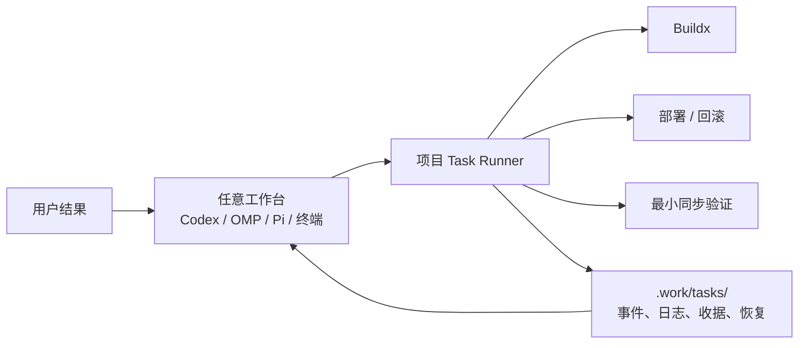

# Pi/OMP + Team OS 工作流原理与日常使用

> 本文描述当前工作流合同。模型、Provider 和登录配置属于运行时配置；任务状态、构建、部署、验证和恢复属于项目执行引擎。

## 1. 核心模型


```mermaid
flowchart LR
  U[用户结果] --> H[任意工作台
Codex / OMP / Pi / 终端]
  H --> R[项目 Task Runner]
  R --> B[Buildx]
  R --> D[部署 / 回滚]
  R --> V[最小同步验证]
  R --> E[.work/tasks/<id>
事件、日志、收据、恢复]
  E --> H
```

工作台负责理解、修改和决策；Task Runner 负责长命令、构建、刷新、验证、日志和恢复；`.work/tasks/<id>` 是跨会话的事实源。工作台退出不能丢失已经启动的任务。

## 2. OMP 角色

只有三类角色：

| 角色 | 工作内容 | 默认状态 |
| --- | --- | --- |
| `@owner` | 定界、实现、验证、综合和最终报告 | 每个结果默认启用 |
| `@worker` | 自足派工包内的独立取证、批量机械工作或互斥实现 | 按需启用 |
| `@reviewer` | 高风险或明确要求的只读挑战 | 按需启用 |

UI、视觉、数据库和 SRE 是能力标签。它们不会自动创建额外 Session，也不会形成规划→视觉→实现→审阅的固定接力。

## 3. 最短任务闭环

1. 说清用户可验证结果、非目标、目标项目、写入范围、验收和停止条件。
2. Owner 读取项目 `AGENTS.md`、目标正式设计和必要代码片段。
3. 小任务直接完成；只有独有证据、互斥写集合或高风险独立验证足以覆盖协调成本时才派 Worker/Reviewer。
4. 长命令交给项目 Task Runner，必须显示实际命令、阶段、日志路径、预计耗时和 hard timeout。
5. 前台只保留能判定结果的最小 smoke；完整 e2e、长回归和报表在后台运行。
6. 失败回到同一个 Owner 收敛；同一验收点达到失败预算或根因越界时停止当前方法并重新定界。

## 4. 项目 Task Runner

以 `jusuan-installer` 为例：

```bash
# 创建项目计划
python3 .agents/scripts/juspctl.py plan ...

# 独立于当前会话运行
python3 .agents/scripts/juspctl.py start \
  --plan .work/tasks/<task-id>/plan.json \
  --confirm-remote-write

# 换会话查看状态和实时输出
python3 .agents/scripts/juspctl.py status --task <task-id>
python3 .agents/scripts/juspctl.py tail --task <task-id> --follow
python3 .agents/scripts/juspctl.py resume --task <task-id>
```

每个任务会固定自己的 delivery manifest 快照、候选 digest、阶段日志和状态文件。并发任务不会写同一个公共可变 manifest。`resume` 只读展示阶段恢复点；失败阶段的重试须重新确认授权，避免重放已成功的生产 rollout。

## 5. 生产刷新路径

单组件、镜像已准备好的刷新走最短路径：

```text
目标 preflight → 任务级候选/镜像 digest → 单组件 rollout → 原入口最小 smoke
```

冻结门禁只在用户显式要求、专项、多组件或计划识别到迁移、权限、计费、部署合同等高风险路径时启用。数据库迁移、共享路由、权限、跨服务兼容和不可逆写入仍使用更高风险路径；风险路径的保护不能被普通单组件刷新继承或反向扩大。

## 6. 日常说法

不需要填写合同字段；说清想解决、实现或验证的事即可。Owner 按 [`自然语言需求编译工作流`](../../workflows/request-compiler.md) 和项目事实补齐范围、验证与停止条件，只有产品决策、生产/远端写、删除、凭据或事实冲突才回问。以下说法对应真实的编译与路由行为，可以照说。

| 你说 | 实际进入 | 行为要点 |
| --- | --- | --- |
| “排查/只分析 <问题>，先别改” | `diagnose`（只读） | 可证伪循环取证，不推导修复授权 |
| “定位并修复 <症状>” | `deliver-change` 判定车道 → `diagnose` 同环 | 已有症状的定位修复由 diagnose 单流程持有；先最小复现再改根因 |
| “设计/规划 <目标>，比较两个方案” | `design` | 只收敛设计或实施规划，不写实现 |
| “按结论推进 / 实现 / 修复 <需求>” | `deliver-change` | 最小纵向切片 + 适用 Gate；UI 只是能力标签，不自动派生视觉角色 |
| “只验证 <场景或入口>” | `guard` | 只跑定向门禁/healthcheck/smoke，不升级为全量 |
| “审一下 <commit/分支/工作区>” | owner 分类 → `review` | 只读挑战，输出带路径行号的可执行 findings |
| “提交并推送这批变更” | owner 分类 → `ship-changes` | 唯一提交入口；仍需你当次明确授权 |
| “继续上次任务 / 按现有结论继续” | 恢复原 owner | 读 `.work` 的任务状态、有效收据和当前规范，沿用原 taskId，不重复规划 |

重新分析之前得出的问题根因结论和设计思路解决方案，需要描述的形象而准确，不要堆积专有名词。

生产相关说法：

| 你说 | 实际进入 |
| --- | --- |
| “把 <组件> 的修复刷新到生产” | `deliver-change`；单组件 image-only 时走 `juspctl fast-deploy`（门禁→构建→rollout→代次绑定 smoke→失败自动回滚），命中迁移、多组件或高风险路径自动回退完整 `plan`+`apply` |
| “线上故障，先把 <表> 的 <数据> 改成 <值> 止血” | break-glass 数据热修（项目发版规范 break-glass 节）：这句话本身就是授权，编译会再确认一次目标与意图；事务化幂等 SQL + 前后不变量审计；止血后必须另建任务补正式修复 |
| “看下任务进度 / 把日志给我” | `juspctl status/tail --task <id>`，换会话依然有效 |
| “把这个计划放后台跑” | `juspctl start`；工作台退出不丢任务 |

反模式（说了也不会照做）：

- “跳过门禁/冻结直接上生产”——没有当次授权不写远端；声明 `requiresFreeze` 的计划缺收据时失败关闭。
- 对小改动要求“先出几个方案再动手”——没有强制规划比例；只有方案真实分歧时才比较。
- “顺便清理无关旧代码”——不做授权外扩张。
- 在话术里粘贴 token、密码——内容先脱敏，凭据只按项目安全合同使用。

运行态操作（换模型、重载规则）不是业务场景：说“将 <role> 角色变更为 <provider/model>”后必须实际落到 `/model`、`--model` 或 Profile，并回报旧/新模型、作用域、fallback、resolved model 和恢复方式；规范更新后旧 Session 不自动重写上下文，优先新建或恢复 Session。必须留在已打开的旧 Session 时，输入：

```text
工作流已翻新，忽略你上下文中的旧流程记忆，按以下来源重建认知：
1. 重新读取 ~/.omp/profiles/team-os/agent/AGENTS.md 与 RULES.md、本仓库 AGENTS.md、docs/平台开发联调部署规范.md 和命中的 Skill。
2. 只做规则加载与状态确认：读取当前 taskId 的 .work 状态与有效收据，确认 resolved model；不创建新任务、不改代码、不重新规划已有结论。
3. 完成后回报：已加载文件清单、当前任务状态，并用三句话复述关键差异（角色模型、生产入口、验证路径）。
```

## 7. 收尾

完成条件包括：目标结果、适用验证、必要运行事实和剩余风险已经记录。模型路由统计、派工比例和 Session 话术只用于复盘，不是 close Gate。动态命令和日志留在 `.work`；长期稳定方法才回写 Team OS。
