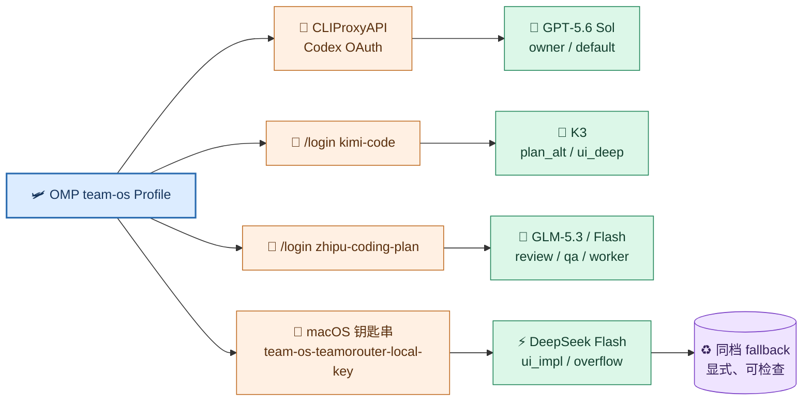

# Pi/OMP + Team OS 配置实施记录

> 本文记录 Team OS 在本机 OMP Profile 中的安装、Provider 接线、角色绑定和验证结果。它是“当前配置快照 + 可复现操作记录”，不是角色职责或工作流原则的唯一来源。
>
> 稳定工作流见 [`02-Pi-OMP-Team-OS工作流原理与日常使用.md`](./02-Pi-OMP-Team-OS工作流原理与日常使用.md)。模型能力与默认路由的机器事实见 [`models/catalog.yaml`](../../models/catalog.yaml)。

## 1. 事实边界

| 内容 | 唯一事实源 | 本文是否复制 |
| --- | --- | --- |
| 角色职责、协作和验收原则 | Team OS `AGENTS.md`、`omp/AGENTS.md`、工作流文档 | 只记录当前映射，不重写原则 |
| 模型默认绑定与回退链 | `models/catalog.yaml` 的 `activePortfolio` | 记录便于操作，但目录优先 |
| OMP 实际 Profile 设置 | `~/.omp/profiles/team-os/agent/config.yml` | 记录当前值和修改入口 |
| Provider、认证和模型发现 | Profile `models.yml`、本机钥匙串、CLIProxyAPI | 只记录路径和安全边界，不记录密钥 |
| Session、用量和临时切换 | OMP 运行态与 Agent Hub | 不写入长期文档；只记录检查方法 |

配置变化后，先改 Team OS 源或本机配置的正确事实源，再运行验证；不要直接手改已投影的 `~/.omp/profiles/team-os/agent/AGENTS.md`、`RULES.md` 或 Skill。

## 2. 安装和重新投影

在 Team OS 仓库运行：

```bash
cd /Users/kailonyang/go/src/team-os
python3 scripts/install_runtime.py omp --profile team-os
python3 scripts/install_runtime.py omp --profile team-os --check
```

受管投影位于：

```text
~/.omp/profiles/team-os/agent/
├── AGENTS.md
├── RULES.md
├── agents/
├── models/catalog.yaml
├── skills/
└── team-os-install.json
```

安装器只管理 Team OS 清单内的投影文件，不覆盖 Profile 的认证、`models.yml` 和 `config.yml`。如果修改的是角色绑定或运行设置，需要在 Profile 中完成并另行执行路由检查。

## 3. 当前 Profile 基线

以下是本次收敛时的目标基线；以本机 `config.yml` 和命令输出为准：

```yaml
contextPromotion:
  enabled: true
task:
  agentModelOverrides:
    task: "@fast_worker"
    scout: "@fast_worker"
    sonic: "@fast_worker"
  showResolvedModelBadge: true
modelRoles:
  plan_owner: cliproxyapi/gpt-5.6-sol
  plan_alt: kimi-code/k3-256k
  deep_review: zhipu-coding-plan/glm-5.3
  ui_deep: kimi-code/k3
  ui_qa: zhipu-coding-plan/glm-5.3-flash
  fast_worker: zhipu-coding-plan/glm-5.3-flash
  ui_impl: teamorouter/deepseek-flash
  fast_alt: kimi-code/kimi-for-coding-highspeed
  default: cliproxyapi/gpt-5.6-sol:medium
```

并发、递归、Browser 和 Computer 是能力上限，不是自动 fan-out：

```bash
omp --profile team-os config set task.maxConcurrency 12
omp --profile team-os config set task.maxRecursionDepth 2
omp --profile team-os config set task.maxRuntimeMs 1800000
omp --profile team-os config set task.showResolvedModelBadge true
omp --profile team-os config set browser.enabled true
omp --profile team-os config set computer.enabled true
```

`tools.approvalMode` 仍服从本机安全策略和用户授权；不要用 `--auto-approve` 或 `approval-mode=yolo` 作为长期配置。

## 4. 角色绑定快照

角色职责不随模型名变化。当前默认模型只是可替换的运行绑定：

| 角色 | 当前默认 | 主要用途 | 典型备用 |
| --- | --- | --- | --- |
| `default` | GPT‑5.6 Sol | 主 Session 与未绑定回退 | K3 / GLM，须显式切换 |
| `plan_owner` | GPT‑5.6 Sol | 裁决型规划、状态冻结、最终综合 | GLM‑5.3 → K3‑256K |
| `plan_alt` | K3‑256K | 评审型规划草案和失败面矩阵 | GLM‑5.3 |
| `deep_review` | GLM‑5.3 | 异厂红队、只读深度评审 | K3 |
| `ui_deep` | K3 | UI/UX、视觉判断和设计合同 | GPT‑6 Astra 或 GLM‑Flash |
| `ui_qa` | GLM‑5.3‑Flash | 截图/DOM 事实核对 | 目录允许的视觉模型 |
| `fast_worker` | GLM‑5.3‑Flash | 侦察、批量取证和有界执行 | 免费 Flash → DeepSeek |
| `ui_impl` | DeepSeek Flash | 按视觉合同实现前端 | GLM‑Flash 免费变体 |
| `fast_alt` | Kimi 高速模型 | 显式高速备选 | 不用于自动救火 |

机器目录中的对应字段：`ompResolvedSelectors` 是默认 selector，`ompAgentFallbacks` 是命名 Agent 回退链，`ompTaskAgentModelOverrides` 是泛型 worker 绑定，`standbySelectors` 是显式高级替代，`temporaryBindings` 是跨 Session 临时例外登记。

## 5. 会话级和持久级切换

### 5.1 当前会话临时切换

```bash
omp --profile team-os --model @plan_owner
omp --profile team-os --model cliproxyapi/gpt-6-astra
```

交互会话中也可以用 `/model` 的 Roles 视图。自然语言请求如“`plan_owner` 角色变更为 `kimi-code/k3-256k`”表示显式变更意图，必须实际完成 OMP 的角色选择或配置修改后才算成功。

切换回执至少包含：角色、旧模型、新模型、作用域、fallback、resolved model 和恢复方式。清除临时绑定后应恢复 `catalog.yaml` 默认。

### 5.2 持久角色覆盖

只修改 Profile 的 `config.yml`：

```yaml
modelRoles:
  plan_owner: cliproxyapi/gpt-6-astra
```

持久覆盖会影响后续新 Session 和 worker；单次任务优先使用 `--model`、`/model` 或 Agent Hub 的角色选择。

### 5.3 变更后检查

```bash
python3 scripts/check_model_routes.py \
  --profile /Users/kailonyang/.omp/profiles/team-os \
  --stats-days 1
```

检查失败时先停止该 worker 或切换，不要接受模型不可用、Provider 跨档或未声明 fallback 的静默降级。

## 6. Provider 接入记录

### 6.1 CLIProxyAPI / Codex OAuth

当前用于 `plan_owner`、`default` 和 GPT 高级替代：

| 对象 | 路径或值 | 约束 |
| --- | --- | --- |
| 服务监听 | `127.0.0.1:8317` | 只允许本机连接 |
| CLIProxyAPI 配置 | `/opt/homebrew/etc/cliproxyapi.conf` | 不复制进仓库 |
| Codex OAuth | `~/.cli-proxy-api/` | 由 CLIProxyAPI 管理，不手工复制 |
| 本地下游 Key | 钥匙串 `team-os-cliproxyapi-local-key` | 文档不记录明文 |
| OMP 接线 | Profile `models.yml` | 使用 `openai-responses` 与模型发现 |
| 当前 selector | `cliproxyapi/gpt-5.6-sol`、`cliproxyapi/gpt-6-astra` | 必须带 Provider 前缀 |

安装或重新授权：

```bash
brew install cliproxyapi
cliproxyapi -codex-login -config /opt/homebrew/etc/cliproxyapi.conf
brew services restart cliproxyapi
brew services info cliproxyapi
omp --profile team-os models cliproxyapi
```

当前不安装 `@router-for-me/pi-cliproxyapi-provider`；采用 OMP 原生 `models.yml`。重新准入必须重新验证模型发现、流式响应、工具调用和 Session 恢复。

### 6.2 Kimi、智谱和执行通道

| Provider | 当前角色 | 接入方式 | 注意 |
| --- | --- | --- | --- |
| `kimi-code` | `plan_alt`、`ui_deep`、`fast_alt` | `/login kimi-code` | 会员池与其它 Kimi 产品共享；长上下文按需使用 |
| `zhipu-coding-plan` | `deep_review`、`ui_qa`、`fast_worker` | `/login zhipu-coding-plan` | 额度和高峰系数以 Provider 事实为准 |
| `teamorouter` | `ui_impl`、执行池溢出 | Profile `models.yml` | 只按量接执行工作，不承担默认 Owner |
| `deepseek` | 执行档同计费档回退 | Profile `models.yml` | 必须使用全限定 selector |

登录后检查：

```bash
omp --profile team-os models kimi-code
omp --profile team-os models zhipu-coding-plan
omp --profile team-os models teamorouter
omp usage
```



### 6.3 TeamoRouter 配置形状

凭据只放钥匙串，Profile 只保存引用：

```yaml
providers:
  teamorouter:
    baseUrl: https://api.teamorouter.com/v1
    apiKey: "!security find-generic-password -w -a kailonyang -s team-os-teamorouter-local-key"
    authHeader: true
    api: openai-completions
    discovery:
      type: openai-models-list
      timeoutMs: 15000
```

首次接入：

```bash
security add-generic-password -a "$USER" -s team-os-teamorouter-local-key -w
omp --profile team-os models teamorouter
omp --profile team-os --model teamorouter/deepseek-flash
```

Provider selector 必须带前缀。新增 Provider 只扩大可选模型集合，不改变角色职责，也不授予生产写、外部发送、删除或凭据操作权限。

## 7. Context Promotion

K3 的 1M 上下文是按需能力，不是默认角色。当前配置保留晋升目标：

```yaml
providers:
  kimi-code:
    modelOverrides:
      k3-256k:
        contextPromotionTarget: kimi-code/k3
```

晋升必须以临时 `model_change` 或等价运行收据可见，不改变 `modelRoles`。短任务不要主动切到 1M；上下文长期偏大时优先压缩证据和恢复包。

## 8. 维护和故障检查

| 症状 | 先检查 | 处置 |
| --- | --- | --- |
| 规则没生效 | `config path`、安装器 `--check`、Session 是否为新建 | 重新投影并新建 Session |
| 模型角色不对 | `/model` Roles、Agent Hub resolved model、`check_model_routes.py` | 修正 Profile 或目录，不接受静默 fallback |
| Provider 无模型 | `omp --profile team-os models <provider>`、钥匙串引用、`models.yml` schema | 先修认证和发现，再改角色 |
| Browser/Computer 不可用 | Profile 开关、`/computer status`、macOS 权限 | 新建 Session 后复核 |
| Session 恢复重复规划 | 项目 `.work` 的 outcome、授权、变更和收据 | 不搬完整 Transcript，按最小恢复包继续 |
| 上下文过长 | `.work` 是否已落盘、`/compact`、是否需要新 Session | 先压缩动态事实，再切换模型 |

动态故障日志、用量样本和临时账号状态不要写入本文；放到本机运行态或项目 `.work`。

## 9. 变更后的最小验收

```bash
cd /Users/kailonyang/go/src/team-os
python3 scripts/install_runtime.py omp --profile team-os --check
python3 scripts/check_model_routes.py --profile /Users/kailonyang/.omp/profiles/team-os --stats-days 1
python3 scripts/test_check_model_routes.py
python3 scripts/test_check_role_routing.py
```

验收要求：投影无 drift、路由 `issues=[]` 且 `gaps=[]`、临时绑定可识别、Agent Hub 可显示 resolved model。完成后新建 OMP Session；旧 Session 不会自动重写历史上下文。

## 10. 相关入口

- 工作流原理与日常使用：[`02-Pi-OMP-Team-OS工作流原理与日常使用.md`](./02-Pi-OMP-Team-OS工作流原理与日常使用.md)
- OMP 适配器入口：[`omp/README.md`](../../omp/README.md)
- 模型目录：[`models/catalog.yaml`](../../models/catalog.yaml)
- 模型策略说明：[`models/README.md`](../../models/README.md)
- 路由检查器：[`scripts/check_model_routes.py`](../../scripts/check_model_routes.py)
