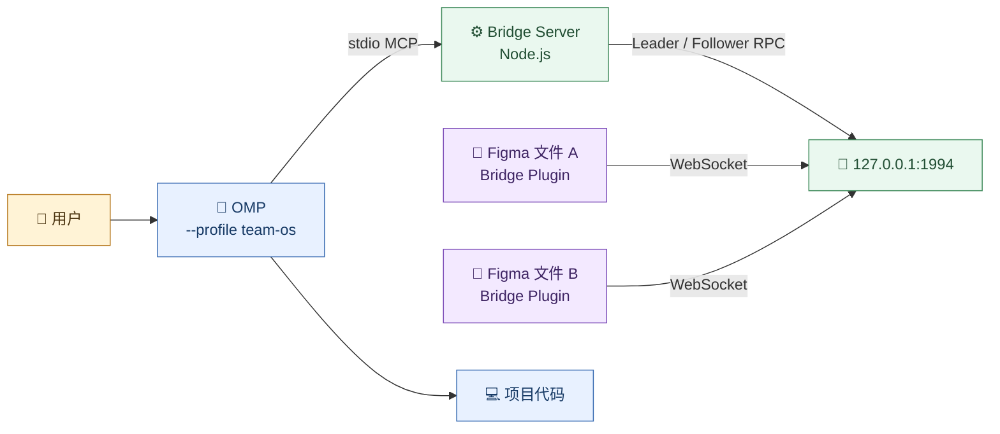

# OMP + Figma MCP Bridge 从 0 到 1 使用手册

本文面向已经选择 OMP 作为主要 Agent harness、希望绕开 Figma 官方 MCP
额度限制，并直接读取或修改本地 Figma 画布的用户。这里的 Bridge 特指
[`gethopp/figma-mcp-bridge`](https://github.com/gethopp/figma-mcp-bridge)，不是
Figma 官方 Desktop MCP。

当前验证基线：

- OMP `18.1.21`；
- Figma MCP Bridge 发布包 `0.0.21`；
- Node.js `26.7.0`；
- macOS Apple Silicon；
- Team OS 命名 Profile：`team-os`。

版本号变化后优先核对 Bridge 的 README、工具清单和 Figma Plugin manifest，
不要直接假设新旧 Server 与 Plugin 一定兼容。

> 你当前已经完成 Figma Plugin 导入，且本机 Bridge 健康端口和读取链路均已
> 验证。实际使用可以直接从第 4 节“把 Bridge 接入 OMP”开始；第 3 节保留给
> 重装、换电脑或以后排查环境时使用。

## 1. 最终会得到什么

完成本手册后，链路应当是：



OMP 与 Figma 不直接通信：

1. OMP 为每个使用该 MCP 的 Session 启动一个 Bridge Server 子进程；
2. 第一个 Server 占用 `127.0.0.1:1994` 并成为 Leader；
3. 后续 OMP、Codex 或其他客户端的 Server 成为 Follower，通过 `/rpc` 转发；
4. Figma 文件中的 Bridge Plugin 主动连接 Leader 的 `/ws`；
5. OMP 调用 MCP tool，Plugin 在目标 Figma 文件中读取或写入。

因此不需要手动常驻一个全局 Server，也不要看到多个 Bridge Node 进程就立即
`killall node`。多客户端和 Leader/Follower 是这套 Bridge 的正常设计。

## 2. 能做什么，不能做什么

### 2.1 读取能力

| 能力 | 主要工具 | 典型用途 |
| --- | --- | --- |
| 查看已连接文件 | `list_files` | 获得 `fileKey`，避免操作错文件 |
| 读取当前选择 | `get_selection` | 从用户在 Figma 中选中的 Frame 开始 |
| 读取页面树 | `get_document` | 查看当前页面的节点层级 |
| 读取单个节点 | `get_node` | 按 `nodeId` 精确检查组件或图层 |
| 读取设计上下文 | `get_design_context` | 获取适合模型理解的有界设计树 |
| 读取样式和变量 | `get_styles`、`get_variable_defs` | 对齐颜色、字体、间距和 Design Token |
| 获取图片证据 | `get_screenshot`、`save_screenshots` | 视觉评审、前端还原和验收 |
| 读取动效 | `get_motion_styles`、`get_node_motion` | 检查已有动效；当前仍为 beta |

### 2.2 写入能力

Bridge 可以修改文本、通用节点属性、填充、描边、阴影、Auto Layout 和可见性，
也可以创建 Page、Frame、Text、Shape、Image，复制、移动、组合或删除节点。

当前能力仍有边界：

- 不完整支持 Component/Instance/Variant 的创建与治理；
- 不支持 Variables/Styles 的完整创作闭环；
- 不支持逐字符富文本和 Vector Boolean；
- Motion 工具是 beta；
- `delete_nodes` 虽要求 `confirm: true`，但其他写工具没有统一的技术审批 Gate；
- 写工具必须在 Figma **Design 编辑模式**运行，Dev Mode 是只读的。

所以 Team OS 默认采用：**读取可并行，画布写入单一负责人串行执行**。

## 3. 第一次准备

### 3.1 安装并检查 OMP Profile

如果尚未安装 Team OS 的 OMP 投影：

```bash
cd ~/go/src/team-os
python3 scripts/install_runtime.py omp --profile team-os
python3 scripts/install_runtime.py omp --profile team-os --check
```

确认 Profile 的运行目录：

```bash
omp --profile team-os config path
```

预期类似：

```text
~/.omp/profiles/team-os/agent
```

后续 MCP 配置必须写入这个 Profile，而不是默认的 `~/.omp/agent`，否则
`omp --profile team-os` 看不到它。

### 3.2 安装 Figma MCP Bridge Plugin

从 Bridge 的 GitHub Release 下载与 Server 匹配的发布包。在 Figma 中执行：

```text
Plugins
  → Development
  → Import plugin from manifest…
  → 选择解压目录中的 manifest.json
```

当前机器已经导入的 manifest 位于：

```text
~/Documents/Codex/Figma MCP Bridge/manifest.json
```

导入只需要做一次，但每个要连接的 Figma 文件都必须分别运行 Plugin，并保持
Plugin 面板打开。关闭面板会断开该文件的 WebSocket。

### 3.3 检查 Node 和 npx

```bash
node --version
command -v npx
```

Bridge 要求 Node.js 20 或更高版本。Apple Silicon Homebrew 的 `npx` 通常是：

```text
/opt/homebrew/bin/npx
```

如果实际输出不同，下一节配置中的 `command` 必须使用你的真实绝对路径。

## 4. 把 Bridge 接入 OMP

### 4.1 推荐方式：固定 npm 发布版本

打开或创建：

```text
~/.omp/profiles/team-os/agent/mcp.json
```

如果文件原本不存在，使用以下完整内容：

```json
{
  "$schema": "https://raw.githubusercontent.com/can1357/oh-my-pi/main/packages/coding-agent/src/config/mcp-schema.json",
  "mcpServers": {
    "figma-local-bridge": {
      "command": "/opt/homebrew/bin/npx",
      "args": [
        "-y",
        "@gethopp/figma-mcp-bridge@0.0.21"
      ],
      "timeout": 210000
    }
  }
}
```

如果已经存在 `mcp.json`，只把 `figma-local-bridge` 合并进原有
`mcpServers`，不要覆盖其他 Server 或 `disabledServers`。

这里刻意固定为 `0.0.21`：

- 避免每次启动下载不同版本；
- 确保 Server 与已经导入的 Figma Plugin 来自同一个 Release；
- 更新前可以先看 release notes，并保留明确回退版本。

`timeout` 使用毫秒。Bridge 自己允许最长约三分钟的画布请求，OMP 默认 MCP
超时更短，因此这里设置为 210 秒，避免大 Frame 截图或设计树读取被 OMP 提前
取消。

### 4.2 可选方式：复用本机已安装的 Server

当前机器也有已构建的 Server：

```text
~/.codex/tools/figma-mcp-bridge-v0.0.21/server/dist/index.js
```

希望完全避免 `npx` 下载时，可以改用：

```json
{
  "$schema": "https://raw.githubusercontent.com/can1357/oh-my-pi/main/packages/coding-agent/src/config/mcp-schema.json",
  "mcpServers": {
    "figma-local-bridge": {
      "command": "/opt/homebrew/bin/node",
      "args": [
        "/Users/<你的用户名>/.codex/tools/figma-mcp-bridge-v0.0.21/server/dist/index.js"
      ],
      "timeout": 210000
    }
  }
}
```

JSON 中的 `~` 不应被假定会自动展开，`args` 要使用真实绝对路径。该方式依赖
Codex 工具缓存；如果以后卸载、升级或清理 Codex，OMP 配置也会失效。因此长期
使用仍优先推荐固定 npm 版本。

### 4.3 为什么不直接复用 Codex 的 MCP 配置

OMP 虽然能发现部分其他客户端配置，但 Team OS Profile 应保留明确的原生
`mcp.json`：

- 配置来源能通过 `/mcp list` 清楚看到；
- 不依赖 Codex 是否安装或是否启用该 MCP；
- Codex 当前的 `enabled_tools` 可能只暴露读取工具，不能代表 OMP 的完整能力；
- Profile 的 Session、模型和 MCP 生命周期保持一致。

MCP 配置只保存在本机运行环境，不提交 Team OS 或业务项目仓库。

## 5. 第一次启动和连接

顺序很重要：

1. 在 Figma 打开目标 Design 文件；
2. 切到 Design 编辑模式；
3. 运行 `Plugins → Development → Figma MCP Bridge`；
4. 保持 Plugin 面板打开；
5. 从目标项目目录启动 OMP；
6. 在 OMP 中刷新并检查 MCP。

```bash
cd <目标项目目录>
omp --profile team-os
```

在 OMP 输入：

```text
/mcp reload
/mcp list
/mcp test figma-local-bridge
```

判断标准：

- `/mcp list` 能看到 `figma-local-bridge`；
- 来源是 `team-os` Profile 的 `mcp.json`；
- `/mcp test figma-local-bridge` 能完成 initialize 和 tools/list；
- 不出现 `No plugin connected`；
- Figma Plugin 面板保持 connected。

Server 启动后可以在另一个终端做只读健康检查：

```bash
curl -fsS http://127.0.0.1:1994/ping
lsof -nP -iTCP:1994
```

健康响应类似：

```json
{"status":"ok","version":"0.1.1"}
```

Bridge Release、根 package 与内部 Server 可能显示不同版本号；只要使用同一
Release 的 Plugin/Server，并且 `/ping` 与 MCP 测试通过，就不要仅因内部版本号
不同判定失败。

## 6. 三步安全烟测

### 6.1 第一步：只列文件

在 OMP 里直接说：

```text
调用 figma-local-bridge 的 list_files，只报告已连接文件的名称和数量。
不要读取完整画布，不要调用任何写工具。
```

如果只有一个文件，后续工具可以省略 `fileKey`。如果同时打开多个 Figma 文件，
必须先取得目标 `fileKey`，后续每次调用都显式携带它。

`fileKey` 是运行时路由标识，不要写进 Team OS 文档、Prompt 模板或 Git。

### 6.2 第二步：读取当前选区

先在 Figma 中选中一个体量较小的 Frame，然后说：

```text
只读取我当前选中的 Figma Frame。
先调用 get_selection，再调用 get_design_context，最大深度从 3 开始；
需要视觉证据时再调用 get_screenshot。
输出页面结构、组件、Auto Layout、间距、字体、颜色和变量摘要。
不要修改画布或项目代码。
```

通过条件：

- OMP 返回的节点名称与当前选择一致；
- 能看到结构信息而不只是截图猜测；
- 截图与 Figma 当前画面一致；
- 没有读取无关页面的完整大树。

### 6.3 第三步：在隔离页面做写入烟测

第一次不要直接修改正式页面。使用空白测试文件，或在副本中新建隔离 Page：

```text
目标只允许是刚才 list_files 返回的 <目标 fileKey>。
先 get_metadata 确认文件，然后创建一个名为 OMP-Bridge-Smoke 的新 Page。
在该 Page 创建一个 480×240 的 Frame，名称为 Bridge Smoke，
浅灰背景、16px 圆角、24px padding，并加入标题“OMP Bridge Connected”。
不要修改现有 Page，不要删除、移动或覆盖现有节点。
完成后读取新 Frame 并截图，核对结构和视觉结果。
```

通过条件：

- 新 Page 与 Frame 出现在指定文件；
- 原有页面和节点未改变；
- 读取结果与截图都能证明新 Frame 的尺寸、文本和布局；
- OMP 明确报告创建出的 Page ID、Frame ID 和剩余边界。

烟测结束后，如需删除测试页面，优先在 Figma UI 手工删除。不要把
`delete_nodes confirm:true` 当作日常清理捷径。

## 7. 日常可直接复制的说法

### 7.1 只读分析当前设计

```text
使用 Figma Bridge 读取当前 selection，先结构后截图。
只总结信息架构、组件层级、Auto Layout、Token 和交互状态；不要写画布或代码。
```

### 7.2 从设计实现前端

```text
读取当前 Figma selection，并对照本仓库现有组件、路由和设计 Token。
先列出可复用组件、真实差异和最小实现范围；确认后由当前 owner 实施。
Figma 是设计事实源，项目组件与业务状态合同仍以项目权威为准。
```

### 7.3 对照代码检查还原度

```text
读取当前 Figma selection 的结构和截图，再打开本地页面真实入口。
按布局、字体、颜色、间距、组件状态和响应式逐项比较，只报告可观察差异，
不要用主观评分代替证据。
```

### 7.4 修改一段文字

```text
只操作 <fileKey> 中我当前选中的单个 Text 节点。
先 get_selection 报告 nodeId、当前文本和字体，等我确认后再用
set_text_content 改成“<新文本>”；不要改变样式、位置或其他节点。
修改后重新读取该节点验证。
```

### 7.5 创建新页面方案

```text
只在 <fileKey> 中创建一个新 Page“方案 B”，不要修改现有页面。
由当前 owner 保持单写；UI designer 可以先只读输出设计基线，
最终写入按 Page → Frame → Text/Shape 的顺序执行，每一阶段读回验证。
```

### 7.6 多文件对照

```text
先调用 list_files，分别确定“设计系统”和“产品页面”的 fileKey。
只读设计系统中的组件、变量和样式，再读取产品页面当前 selection；
不要省略 fileKey，不要跨文件执行写操作。
```

### 7.7 导出视觉证据

```text
对当前 selection 调用 get_screenshot，只导出选中 Frame，不导出整页。
如果需要落盘，先报告目标目录、文件名和预计数量，经确认后再调用
save_screenshots；不要把 base64 或临时图片写入长期文档。
```

## 8. 工具选择顺序

不要一上来读取整份 Document。推荐顺序：

```text
list_files
    ↓
get_metadata
    ↓
get_selection
    ↓
get_design_context(depth=3)
    ↓
get_node / get_variable_defs / get_styles
    ↓
get_screenshot
    ↓
明确授权后才调用写工具
    ↓
重新读取 + 截图验证
```

大型页面先用浅层 `get_design_context` 或 `get_document` 识别目标节点，再用
`get_node` 精确展开。这样比一次把完整画布塞入模型上下文更快，也更不容易让
模型把同名 Frame、隐藏节点或无关页面混在一起。

## 9. 多模型与多 Agent 怎么分工

Figma 画布不是 Git worktree，多个 Agent 同时修改同一文件无法自动合并。Team
OS 在这条链路中固定采用单写者：

| 责任 | 推荐模型/Agent | 画布权限 |
| --- | --- | --- |
| outcome、范围、写入与最终验收 | GPT-5.6 Sol 主 Session | 唯一写入者 |
| UI/UX 深度设计和视觉评审 | `team-os-ui-designer` / GPT-6 Astra | 默认只读 |
| 快速枚举节点、样式和变量 | DeepSeek V4.1 Flash 有界 worker | 只读且固定 `fileKey` |
| 高风险设计复核 | `team-os-deep-reviewer` | 只读挑战 |

不要让多个 worker 同时调用 `create_*`、`set_*`、`reparent_nodes` 或
`delete_nodes`。需要方案多样性时，先让各模型只读提出方案，由主 Session
综合后在一个新 Page 中串行落图。

## 10. Design Mode 与 Dev Mode

| Figma 状态 | 读取 | 写入 | 建议 |
| --- | --- | --- | --- |
| Design 编辑模式 | 支持 | 支持，但需要文件编辑权限 | 正式写画布时使用 |
| Dev Mode | 支持 | Bridge 会返回只读错误 | 前端读取、标注和 Code Connect 场景使用 |
| Plugin 面板关闭 | 不可用 | 不可用 | 在目标文件重新运行 Plugin |
| 文件只读权限 | 支持部分读取 | 不支持 | 复制到有编辑权限的草稿再试 |

如果写工具返回只读错误，先检查是否停留在 Dev Mode。不要通过重复调用、重启
OMP 或换模型绕过 Figma 自身权限。

## 11. 文件路径和本地写入

`create_image`、`import_html_layers` 和 `save_screenshots` 会接触本地文件系统：

- OMP 启动 Bridge 时，Server 默认继承 OMP 的当前工作目录；
- 相对路径通常相对于启动 OMP 的项目目录；
- `import_html_layers` 要求 JSON 位于 Server 工作目录以内；
- `save_screenshots` 会真正创建文件，不是纯读取工具；
- 不要把截图、导出物或测试 JSON 默认写到仓库根目录。

建议明确指定项目已有的临时证据目录，例如 `.work/figma/`，并在调用前说明
输出路径、文件数和清理方式。长期文档只引用稳定结果，不保存 base64、完整
画布 JSON 或真实 Session 内容。

## 12. 故障排查

| 现象 | 第一判别事实 | 处理 |
| --- | --- | --- |
| `/mcp list` 没有 Bridge | 配置来源和 Profile | 确认文件是 `~/.omp/profiles/team-os/agent/mcp.json`，再 `/mcp reload` |
| `npx` 启动失败 | `command -v npx` | 把配置中的 `command` 改成真实绝对路径 |
| `No plugin connected` | Figma Plugin 面板是否打开 | 在目标文件重新运行 Figma MCP Bridge，并保持面板打开 |
| `Multiple files connected` | 是否提供 `fileKey` | 先 `list_files`，所有后续调用都显式指定目标 `fileKey` |
| 写入返回只读错误 | Figma 是否处于 Dev Mode | 切回 Design 编辑模式并重新运行 Plugin |
| 操作到了错误文件 | 实际 `fileKey` | 停止写入，重新 `list_files + get_metadata`，不要按文件名猜 |
| MCP 30 秒左右超时 | OMP MCP timeout | 保留 `timeout: 210000`，同时缩小 selection 和读取深度 |
| 端口 1994 已占用 | `/ping` 是否返回 Bridge 健康信息 | 健康则是正常 Leader；不健康时先查 `lsof`，关闭明确的旧 Session，不要 `killall node` |
| 截图/画布树过大 | selection 范围 | 选中更小 Frame，先浅层结构再按 nodeId 展开 |
| 文本修改失败 | 字体和文件权限 | 确认字体在 Figma 可用、节点可编辑、文件不是只读 |
| OMP 能列工具但调用卡住 | Plugin/WebSocket 状态 | 检查 Figma 面板、`/ping` 和 `lsof`；输入未变化时不要盲目重复调用 |

推荐排查顺序：

```text
配置路径
  → /mcp list
  → /mcp test figma-local-bridge
  → curl /ping
  → Figma Plugin connected
  → list_files
  → get_metadata
  → 目标工具
```

## 13. 安全和回退

1. Bridge 只监听 `127.0.0.1:1994`，不要通过端口转发、反向代理或公网暴露。
2. Plugin 可以读取当前 Figma 文件；启用写工具后还可以修改设计，不要在不受信
   Session 中打开敏感文件。
3. 正式页面写入前先 Duplicate 文件或创建独立 Page；高风险修改保留 Figma
   Version History 回退点。
4. 所有写入都固定 `fileKey`，并在写前执行 `get_metadata`。
5. `delete_nodes` 必须由用户明确要求具体 nodeId；不要授权“清理无用节点”这类
   开放式删除。
6. npm Server 固定版本；升级时同步更新 Figma Plugin，不使用静默 `latest`。
7. 不把 `fileKey`、截图 base64、完整 Document JSON 或本机绝对安装路径提交到
   业务仓库。

需要临时停用时，在 OMP 执行：

```text
/mcp disable figma-local-bridge
```

或者从 Profile 的 `mcp.json` 中移除该 Server 后执行：

```text
/mcp reload
```

这只停止 OMP 加载 Bridge，不会删除 Figma 文件或卸载 Plugin。

## 14. 升级流程

不要分别升级 Server 和 Plugin。推荐：

1. 查看 Bridge Release notes 和工具清单变化；
2. 下载同一 Release 的 Plugin；
3. 在 Figma 重新导入对应 manifest/build；
4. 把 OMP `mcp.json` 的 npm 版本改成相同 Release；
5. `/mcp reload`；
6. 依次执行 `list_files → get_metadata → get_selection`；
7. 在隔离 Page 重做一次写入烟测；
8. 失败时同时回退 Plugin 和 Server。

升级不得顺手改变 Team OS 模型角色、业务项目规则或 Figma 正式设计。

## 15. 每日最短流程

```text
打开 Figma 文件
  → 运行并保持 Bridge Plugin 面板
  → 从目标项目启动 omp --profile team-os
  → list_files 锁定 fileKey
  → 在 Figma 选择目标 Frame
  → get_selection + get_design_context
  → 必要时 get_screenshot
  → 明确写入范围
  → 单一 owner 执行写工具
  → 读回 + 截图 + 项目真实入口验收
```

最短检查清单：

- [ ] OMP 使用 `team-os` Profile；
- [ ] `/mcp list` 显示正确配置来源；
- [ ] Figma Plugin 面板保持 connected；
- [ ] 多文件时每次都指定 `fileKey`；
- [ ] 读取从 selection 和浅层结构开始；
- [ ] 正式写入只有一个 owner；
- [ ] 写后重新读取并截图；
- [ ] 临时证据进入 `.work`，秘密和运行态不进 Git。

## 16. 参考来源

- [Figma MCP Bridge](https://github.com/gethopp/figma-mcp-bridge)
- [OMP MCP 配置](https://github.com/can1357/oh-my-pi/blob/main/docs/mcp-config.md)
- [OMP MCP Transport](https://github.com/can1357/oh-my-pi/blob/main/docs/mcp-protocol-transports.md)
- [Pi/OMP + Team OS 日常工作流使用手册](02-Pi-OMP-Team-OS日常工作流使用手册.md)
- [Team OS UI 设计与前端交付工作流](../../workflows/ui-design-frontend.md)
