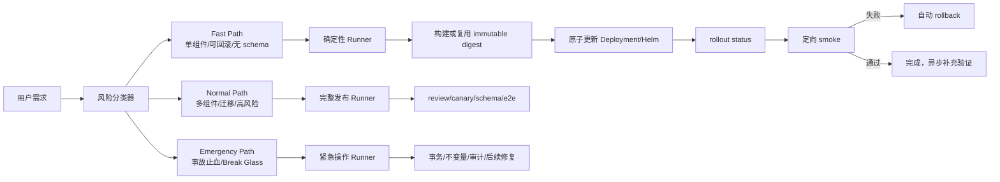
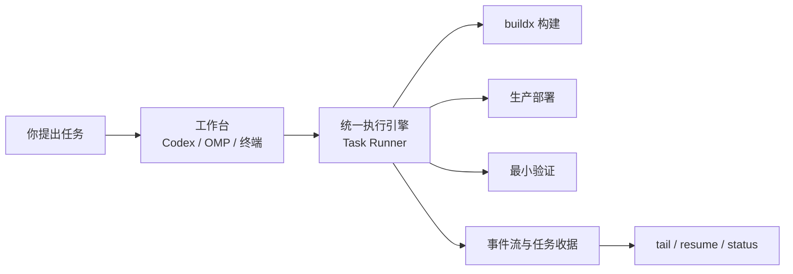

# 问
从/Users/kailonyang/go/src/team-os/docs/使用手册/02-Pi-OMP-Team-OS工作流原理与日常使用.md、\~/.omp、jusuan-installer项目的相关AGENT和规范文档中梳理了解当前team-os工作流现状。我实际使用起来发现有相当严重的缺陷，过往执行任务都记录在/Users/kailonyang/go/src/jusuan-installer/.work/tasks里了，你可以按需采样分析，以下是我列出的一些让我很难受、苦不堪言的痛点，不分先后顺序：

- omp job 都是静默执行，看不到脚本或命令执行进度和明细
- .agents/config/refresh-profiles.json是公用的，多个独立任务运行会冲突，也会涉及修改同一个项目会冲突
- 部署刷新流程完成后e2e运行超过十几分钟非常耗时
- 镜像编译到底应该选择buildx 远端 还是就直接本地buildx 指定架构构建？到底怎样的镜像构建手段才是最高效的？不被缓存、下载公网依赖等一系列问题困扰？
- 问题排查定位，要求快速定位问题，快速落实修改，并刷新生产。但是目前没有能快速整改并刷新生产的手段，总是被冗长的准备工程拖累步伐；有些紧急问题排查出来最快是能给直接线上数据库热修的，但是没有考虑这个途径，还是走常规的流程一步步审阅；
- omp里划分的角色在所有流程中都强制作为一个环境，就很小的问题改动都要强制走reviewer流程强行进行，而且我感觉subagent定位问题或者审阅执行的时候都要花很长时间，感觉给它们的上下文并不足以让他们快速执行对应的任务。
- 生产刷新的流程太繁琐了，不要按照常规老时代软件工程的思想一步步保守的设计，我希望能够1分钟之内级别的刷新，不希望再设计这些传统保守的处理：&#x20;
  1. 更新 candidate-digests.txt → 新 digest？
  2. 置换 manifest（备份当前 → 写冻结）？
  3. rollout tenant（argv 读 candidate-digests.txt）？
  4. 恢复 manifest？
  5. 验证 /auth/me（kubectl logs 或 curl）？

综上所属，该套工作流被繁多的角色、流程、规范层层套牢，已经无法高效高质量的完成任务，在omp里随便一个任务，他都要花1～4h小时才能完成，这跟本是无法接受的，让我怀疑选择omp是错误的。我希望你了解以上信息后，深度思考，基于业界、社区里有没有更加科学且高效的工作流架构设计？目前的传统流程、规范我希望你要以最严格的角度来审查批判，只要是徒劳拖慢运行效率又没有带来执行质量的任何环节或流程，第一判断就是：先砍掉！

# 答
## 结论

你的判断基本正确：**当前拖慢任务的主要原因不是模型能力，而是工作流边界设计错误**。

OMP、Team OS、`juspctl` 和生产刷新脚本被叠成了一条同步链：

```text
自然语言需求
  → 角色分类
  → 规划文档
  → worker 路由
  → reviewer / visual finding
  → freeze
  → remote preflight
  → prepare
  → schema observe
  → rollout wave
  → e2e / browser
  → role-routing gate
  → close
```

这套链条适合审计、复杂发布和高风险变更，却被套到了快速修复、单组件刷新和小范围生产问题上。结果是：

> **运行质量没有按比例提升，但等待、交接、上下文、配置冲突和收据维护显著增加。**

OMP 本身不必放弃。更合理的定位是：

> **OMP 负责理解、判断和编排；确定性的本地 runner 负责构建、部署、回滚和进度输出。**

现在的问题是把 OMP 的异步 Agent Session 也当成了生产执行控制面。

---

## 一、当前实际工作流是什么

### 1. Team OS 文档宣称的设计

手册中定义的是：

- 默认 `solo`
- 只有独有证据、互斥写集合或高风险验证才启用 worker
- 长阶段必须有实时输出和心跳
- UI、review、远端刷新按需路由
- 目标明确时走最短可验证路径

见 [Team OS 工作流手册](</Users/kailonyang/go/src/team-os/docs/使用手册/02-Pi-OMP-Team-OS工作流原理与日常使用.md:179>) 和 [项目 AGENTS.md](</Users/kailonyang/go/src/jusuan-installer/AGENTS.md:28>)。

### 2. 实际执行规则更加严格

`~/.omp` 的常驻规则又增加了硬约束：

- 规划类任务至少一半交给 `@plan_alt`
- 冻结候选必须有 `@deep_review` finding 或显式豁免
- UI 必须经过视觉档
- `juspctl close` 默认运行 role-routing gate
- 订阅档、执行档和视觉档分开计量
- worker 必须有自足派工包

见 [OMP RULES.md](</Users/kailonyang/.omp/profiles/team-os/agent/RULES.md:8>)。

这意味着“默认 solo”实际上不是默认路径。它更像是一个需要不断证明自己可以绕过其它角色的路径。

### 3. 项目机器链条

`juspctl` 当前仍然采用：

1. 读取全局 `.agents/config/refresh-profiles.json`
2. 生成任务计划
3. 执行多层本地 Gate
4. `freeze`
5. 检查 review / visual / remote-preflight
6. prepare
7. schema observe
8. rollout wave
9. 记录远端收据
10. role-routing gate
11. close

相关入口见：

- [juspctl.py manifest 和阶段定义](</Users/kailonyang/go/src/jusuan-installer/.agents/scripts/juspctl.py:32>)
- [juspctl.py 远端执行阶段](</Users/kailonyang/go/src/jusuan-installer/.agents/scripts/juspctl.py:1564>)
- [juspctl.py rollout waves](</Users/kailonyang/go/src/jusuan-installer/.agents/scripts/juspctl.py:1727>)
- [项目生产刷新规则](</Users/kailonyang/go/src/jusuan-installer/AGENTS.md:34>)

### 4. 可观测性其实只实现了一半

`juspctl` 和 `gate_receipts.py` 已经会把命令输出转发到 stderr，并且每 30 秒写心跳。

但是 OMP 自己的日志里出现了：

- `Async job completion delivery failed`
- `Yield queue entry became stale: async-result`
- `stream: local publisher unavailable`

例如：

[OMP 异步结果失效日志](</Users/kailonyang/.omp/profiles/team-os/logs/omp.2026-09-17.22432.log:23>)  
[OMP 本地流发布器不可用](</Users/kailonyang/.omp/profiles/team-os/logs/omp.2026-09-18.10984.log:29>)

所以问题不是“底层完全没有进度”，而是：

> **底层有输出，OMP 的异步传输和前台展示没有形成可靠闭环。**

这正是你看到“job 静默执行”的根因之一。

---

## 二、任务记录证明了流程确实在浪费大量墙钟时间

我采样了 `.work/tasks` 中的任务事件，比较任务墙钟时间与实际命令执行时间：

| 任务 | 任务墙钟时间 | 已记录命令执行时间 | 计划命令数 | 结论 |
|---|---:|---:|---:|---|
| `portal-cors-fix` | 约 49 分钟 | 约 4 分钟 | 12 | 大部分时间不是命令执行 |
| `delivery-20260921-131723` | 约 149 分钟 | 约 19 分钟 | 23 | 交接、审阅、等待、重规划占比很高 |
| `cdn-wave2-long-api` | 约 447 分钟 | 约 15 分钟 | 16 | 典型流程性阻塞 |
| `portal-production-targeted` | 约 97 分钟 | 约 6 分钟 | 18 | 机器执行不是主耗时 |
| `admin-console-third-wave-workbench` | 约 181 分钟 | 约 3 分钟 | 20 | 明显过度编排 |
| `org-bulk-accounts-pricing-prod` | 仍处于 `doing` | 已完成部分执行 | 27 | 5 个 delivery，任务尚未结束 |

证据：

- [portal-cors-fix 状态](</Users/kailonyang/go/src/jusuan-installer/.work/tasks/portal-cors-fix/.workflow/state.json:1>)
- [delivery 状态](</Users/kailonyang/go/src/jusuan-installer/.work/tasks/delivery-20260921-131723/.workflow/state.json:1>)
- [org-bulk 状态](</Users/kailonyang/go/src/jusuan-installer/.work/tasks/org-bulk-accounts-pricing-prod/.workflow/state.json:1>)
- [org-bulk 任务计划](</Users/kailonyang/go/src/jusuan-installer/.work/tasks/org-bulk-accounts-pricing-prod/plan.json:1>)

另外，`org-bulk-accounts-pricing-prod` 目录出现了：

```text
refresh-profiles.user-wip-backup.json
refresh-profiles.user-wip-backup2.json
refresh-profiles.user-wip-backup3.json
refresh-profiles.user-wip-backup4.json
refresh-profiles.user-wip-backup5.json
refresh-profiles.plan-frozen.json
```

这不是偶然操作失误，而是当前设计把一个**共享可变配置文件**当成了任务执行输入之后，必然产生的冲突补丁。

---

## 三、严格审查后的结论：哪些应该砍掉

### 立即删除或降级为可选项

| 当前环节 | 判断 | 改法 |
|---|---|---|
| quick-fix 强制规划文档 | 没有独立质量收益 | 只保留一行目标、影响组件、验证命令 |
| `@plan_alt` 强制比例 | 与任务风险无关 | 删除硬比例，按复杂度选择模型 |
| 每个生产任务强制 reviewer | 把 reviewer 变成行政流程 | 仅高风险变更需要独立 review |
| 每个 UI 任务强制视觉档 | 对非视觉逻辑修改没有收益 | 只有视觉行为变化才触发 |
| freeze finding | 大量任务只是为了获得一份形式收据 | 快速路径由机器风险分类自动豁免 |
| `prod-env` → `refresh` → `smoke` 多次交接 | 角色切换大于执行本身 | 合并成一个确定性 runner |
| candidate digest 文件切换、manifest 备份、恢复 | 手工模拟发布控制器 | 改成原子 desired-state 更新 |
| 每次刷新都跑宽泛 e2e | 把十几分钟测试塞入部署关键路径 | 定向测试同步，全量测试异步 |
| close 前 role-routing gate | 它检查“谁做了”，而不是“结果是否正确” | 变成统计指标，不阻断低风险任务 |
| 任务级全局 manifest 哈希绑定 | 让独立任务共享同一写入热点 | 任务内嵌不可变配置快照 |

### 必须保留的保护

这些不应被删除，而应自动化：

- 镜像必须使用 immutable digest
- 部署前确认目标集群、namespace、当前 generation
- rollout readiness 检查
- 一个最小真实 smoke
- 失败自动 rollback
- 生产写操作可追溯
- 数据库热修的显式授权和审计
- 高风险操作的 blast radius 控制

DORA 的持续交付定义本身就是“快速、安全、可持续地按需发布”，而不是增加人工审批数量。[DORA Continuous Delivery](https://dora.dev/capabilities/continuous-delivery/)  
DORA 也明确建议把长时间测试拆出独立流水线，避免阻塞快速反馈。[DORA Continuous Integration](https://dora.dev/capabilities/continuous-integration/)

---

## 四、建议的新架构：三条流水线，而不是一条大流程



### A. Fast Path：目标是 1～10 分钟

适用：

- 单组件
- 无数据库 schema 变更
- 无权限模型变化
- 无公共 API 合同变化
- 可回滚
- 影响范围明确

流程：

```text
分类
→ 定向本地检查
→ 构建或取得 digest
→ 原子部署
→ rollout status
→ 一个定向 smoke
→ 通过即完成
```

不需要：

- reviewer worker
- 视觉 worker
- `plan_alt`
- 完整实施规划
- 全量 e2e
- 多轮 freeze
- manifest 备份恢复

### B. Normal Path：高风险才走完整流程

适用：

- schema / migration
- 多服务同时变更
- 鉴权、计费、数据一致性
- 基础设施、网络、WAF
- 视觉大改
- 不可逆数据操作
- 需要 canary 或逐波发布

这时才启用：

- 独立 review
- preflight
- schema observe
- canary
- browser / e2e
- 多组件 rollout wave

### C. Emergency Path：允许快速止血

你提到线上数据库热修，这条路径应该正式存在，而不是被常规发布流程吞掉。

适用：

- 生产故障
- 数据错误正在扩大
- 常规构建发布来不及
- 目标是止血或恢复服务

最低合同：

- 明确 incident/task ID
- 明确用户授权
- SQL 必须事务化、幂等
- 执行前后记录不变量和影响行数
- 超时、锁等待和回滚策略
- 自动生成审计收据
- 后续必须补代码修复和复盘

Google SRE 的建议也是：break-glass 可以存在，但必须“有噪声”、可追踪，并在事后补齐正式修复。[Google SRE Break-Glass](https://sre.google/sre-book/testing-reliability/)

---

## 五、生产刷新应该改成什么样

你列出的五步：

```text
更新 candidate-digests.txt
置换 manifest
rollout tenant
恢复 manifest
验证 /auth/me
```

应该收敛为：

```text
juspctl fast-deploy \
  --component portal \
  --image registry/internal/portal@sha256:... \
  --smoke portal-auth
```

Runner 内部执行：

1. 读取任务内不可变计划
2. 确认目标 generation 没漂移
3. 原子更新 Helm release 或 Deployment image
4. `kubectl rollout status --timeout=90s`
5. 执行一个定向 smoke
6. 失败则 `rollout undo`
7. 写一份完整但简短的 NDJSON 收据

Kubernetes 原生 Deployment 已经支持：

- 更新 Pod template
- 滚动发布
- 查看 rollout 状态
- 回滚到上一版本

见 [Kubernetes Deployment](https://kubernetes.io/docs/concepts/workloads/controllers/deployment/) 和 [kubectl set image](https://kubernetes.io/docs/reference/kubectl/generated/kubectl_set/kubectl_set_image/)。

如果未来需要 canary，再使用 Argo Rollouts；它支持 rollback window，使近期版本可以快速回退而不重复完整分析步骤。[Argo Rollouts Rollback Window](https://argo-rollouts.readthedocs.io/en/latest/features/rollback/)

---

## 六、`refresh-profiles.json` 的正确改法

当前问题不是“多人同时编辑时要多做备份”，而是：

> **运行时任务不应修改共享 manifest。**

建议拆成三层：

```text
项目源码中的 profile 定义
        ↓ 只读加载
juspctl plan 生成任务内快照
        ↓
.work/tasks/<task>/delivery-plan.json
        ↓
runner 只消费该快照
```

具体规则：

1. `.agents/config/refresh-profiles.json` 只允许作为源码配置，任务运行期间禁止写入。
2. `juspctl plan` 时把选中的 profile、目标、写集合、验证和 rollout 参数内嵌进任务计划。
3. 任务执行只读取自己的 `delivery-plan.json`。
4. 不同任务只在实际 rollout 资源上竞争锁。
5. `portal.center` 和 `tenant.center` 可以并行准备；只有同时修改同一 Deployment 时才串行。
6. 不再通过备份和恢复共享 manifest 来实现隔离。

这样可以彻底消除任务之间的 manifest 冲突。

---

## 七、镜像构建：本地还是远端 buildx

没有单一答案，正确选择取决于架构、缓存和网络。

| 场景 | 首选 |
|---|---|
| 本机架构与目标一致，Builder 常驻且缓存热 | 本地 buildx |
| 本机是 arm64，目标是 amd64 | 远端 amd64 原生 Builder |
| 目标是 NPU 集群对应架构 | 目标架构原生 Builder |
| 同时构建 amd64 和 arm64 | 多节点 native buildx |
| 只发布一个架构 | 只构建该架构，不要无意义 multi-platform |
| QEMU 模拟编译 | 仅作为兜底 |

Docker 官方明确说明：QEMU 在编译、压缩等计算密集场景明显慢于原生节点；多 native node 更适合复杂构建。[Docker Multi-platform Builds](https://docs.docker.com/build/building/multi-platform/)

推荐策略：

```bash
docker buildx build \
  --platform linux/amd64 \
  --push \
  -t registry.internal/portal:${GIT_SHA} \
  --cache-from type=registry,ref=registry.internal/cache/portal:amd64 \
  --cache-to type=registry,ref=registry.internal/cache/portal:amd64,mode=max \
  .
```

关键点：

- Builder 常驻，不要每次重新创建
- 基础镜像全部走内网 registry
- Go、npm、pip 使用 `RUN --mount=type=cache`
- 依赖使用内部 proxy 或预热镜像
- cache ref 按组件、架构和分支隔离
- 多任务不能同时覆盖同一个 cache ref
- 镜像只构建一次，后续环境只晋级同一个 digest
- 不要让单文件变更触发依赖重新下载

Docker 官方建议使用外部 registry cache、cache mount、合理 Dockerfile 层次和小 build context。[Docker Cache Optimization](https://docs.docker.com/build/cache/optimize/)  
registry cache 适合多阶段构建，并可用 `mode=max` 保存中间层。[Docker Registry Cache](https://docs.docker.com/build/cache/backends/registry/)

建议实际测四个基准：

```text
1. 本地 builder 冷缓存
2. 本地 builder 热缓存
3. 远端 native builder 热缓存
4. 远端 builder + 内网 registry cache
```

比较：

- 首次构建耗时
- 单文件变更耗时
- cache 命中率
- context 上传时间
- 公网依赖下载字节数
- Builder CPU / 网络占用

不要凭感觉决定“远端一定快”或“本地一定快”。

---

## 八、OMP job 静默问题的修复方向

不能再依赖 OMP 的异步 completion queue 作为唯一进度来源。

建议让 runner 同时写：

```text
.work/tasks/<task>/events.ndjson
```

每行包含：

```json
{
  "task": "portal-cors-fix",
  "seq": 42,
  "phase": "rollout",
  "component": "portal.center",
  "status": "running",
  "elapsedSeconds": 31,
  "message": "waiting for deployment readiness"
}
```

然后提供两个入口：

```bash
juspctl run --task <id> --foreground
juspctl tail --task <id>
```

要求：

- 前台模式直接显示命令和输出
- 后台模式始终写 `events.ndjson`
- OMP 只负责订阅和展示
- OMP stream 断开时，任务仍可通过 `tail` 恢复
- 心跳从 30 秒缩短到 5～10 秒
- 每个阶段显示当前命令、耗时、目标组件和下一步
- 不再出现“任务实际上在跑，但界面没有任何可见信息”

这比修补 OMP 的某一个异步队列更可靠。

---

## 九、建议的风险分类

把现在的 `quick-fix / feature / program / ops` 改成更接近实际风险的四档：

| 档位 | 适用场景 | 同步验证 |
|---|---|---|
| R0 | 只读排查 | 不写、不部署 |
| R1 | 本地实现 | 定向单测/类型检查 |
| R2 | 可回滚单组件生产刷新 | rollout + 一个 smoke |
| R3 | schema、多组件、权限、基础设施 | review、canary、完整回归 |
| R4 | 事故止血 | break-glass、事务、不变量、审计 |

模型和角色由风险决定：

- R0/R1/R2：owner solo
- R3：必要时增加独立 review
- UI 只有视觉行为变化才启用视觉档
- R4：owner + 生产执行器，不能等待完整评审队列
- `plan_alt` 不再按比例强制出现

---

## 十、衡量新系统是否真的变快

不要再用“收据数量”“角色数量”“规划文档完整度”衡量质量。

应改成：

- 首个有效事实时间：目标 `< 2 分钟`
- R2 快速刷新：p50 `< 5 分钟`，p95 `< 15 分钟`
- Emergency 止血：目标 `< 5 分钟`
- OMP 可见输出间隔：`< 10 秒`
- 共享 manifest 冲突：`0`
- 快速路径任务占比
- 部署后 rollback 率
- change failure rate
- 返工时间
- 用户纠偏次数
- 全量 e2e 被同步阻塞的次数

DORA 强调的也是小批次、自动部署、快速反馈和可持续交付，而不是流程层级本身。[DORA Small Batches](https://dora.dev/capabilities/working-in-small-batches/) [DORA Deployment Automation](https://dora.dev/capabilities/deployment-automation/)

---

## 最终判断

这套 Team OS 不是“安全性太高”，而是：

1. **把审计流程误当成所有任务的执行流程**
2. **把角色职责误当成每次任务都必须经过的审批链**
3. **把共享配置文件误当成任务输入**
4. **把全量验证误当成每次部署的同步前置条件**
5. **把 OMP 异步 Session 误当成可靠的命令执行终端**
6. **把生产刷新拆成了多个需要人工维护中间状态的步骤**

应该先砍掉这些部分，再谈增加智能路由。

优先级建议是：

1. **先做前台/后台统一事件流**
2. **把 refresh profile 改成任务内不可变快照**
3. **新增 R2 fast-deploy 单命令路径**
4. **取消 quick-fix 的强制 reviewer、plan_alt、freeze**
5. **把全量 e2e 改为异步**
6. **增加正式 break-glass 数据热修路径**
7. **建立持久 native buildx + registry cache**
8. **最后再清理 Team OS 文档和角色规则中的强制路由**

在完成这些之前，继续往现有体系里添加更多角色、收据、Gate 或 Jev，只会让问题更严重。

# 问2
继续回到你的最终结论，其实我还没完全理解你的结论，你能想个什么办法给我讲懂吗？
可以。先把模型、OMP、Codex 这些名字全部拿掉，只看“一个任务到底应该怎么跑”。

# 答2
## 先记住一句话

**聊天工具负责理解任务，执行引擎负责真正执行，任务目录负责保存状态。**

现在的问题是：OMP 同时承担了这三件事，还把角色、审阅、Gate、部署、收据全部绑在了一条固定流水线上。

我建议改成下面这样：



## 三个东西分别负责什么

### 1. 工作台：负责理解和决定

Codex、OMP，甚至终端，都属于工作台。

它们应该做这些事：

- 理解你的目标
- 读取必要代码和文档
- 修改代码
- 选择执行路径
- 告诉你当前进度
- 在失败时帮助定位

它们不应该拥有一套各自独立的部署状态。

### 2. 执行引擎：负责把命令跑完

执行引擎可以叫 `task-runner`，也可以逐步改造现有的 `juspctl`。

它负责：

- 构建镜像
- 推送或同步镜像
- 更新 Kubernetes 工作负载
- 执行数据库热修
- 运行 smoke test
- 保存日志、事件和结果
- 支持中断后继续
- 支持换一个工作台继续查看

关键点是：

**工作台关闭了，任务也不能丢。**

例如你从 Codex 启动生产刷新，Codex 崩了，之后仍然可以执行：

```bash
juspctl status task-123
juspctl tail task-123
juspctl resume task-123
```

任务的真实状态在 `.work/tasks/<task-id>/`，不在某个 OMP 会话里。

### 3. 任务目录：负责记录事实

每个任务都有自己的：

```text
.work/tasks/<task-id>/
  task.yaml          # 目标、范围、风险级别
  plan.json          # 本次实际执行计划
  events.ndjson      # 实时事件流
  receipts/          # 构建、部署、验证收据
  result.json        # 最终结果
```

这样可以解决你现在的几个根本问题：

- 多个任务不会共用一个 `refresh-profiles.json`
- 不会因为某个 OMP job 丢失而丢状态
- 可以看到正在执行哪条命令
- 可以知道任务到底卡在构建、推送、部署还是验证
- 可以复现过去一次任务到底做了什么

---

## 用一个实际例子说明

假设你的任务是：

> 修复 portal 的 CORS 问题，刷新 portal 生产，并验证 `/auth/me`。

### 现在的流程

大概会变成：

```text
读取很多规范
→ 分配 plan_owner
→ 可能分配 plan_alt
→ 修改代码
→ reviewer
→ freeze
→ 生成 candidate-digests.txt
→ 备份 manifest
→ 写临时 manifest
→ rollout
→ 恢复 manifest
→ kubectl logs / curl
→ 可能跑十几分钟 e2e
→ close
```

真正执行命令的时间可能只有几分钟，但任务墙钟时间变成几十分钟甚至几小时。

你之前采样到的任务已经说明了这个问题：

- 有的任务墙钟时间接近 1 小时，命令执行时间只有几分钟
- 有的任务墙钟时间超过 4 小时，实际命令时间只有十几分钟

这说明主要瓶颈不是 CPU、网络或构建，而是流程等待和角色交接。

### 新流程

新流程应该是：

```text
1. 识别为“单组件生产刷新”
2. 当前 owner 直接定位并修改
3. 启动 task-runner
4. 实时显示构建和部署命令
5. 只构建 portal
6. 直接使用不可变镜像 digest 更新 portal
7. 立即执行 /auth/me 和 CORS smoke test
8. 返回成功或回滚
9. 完整 e2e 在后台继续跑
```

前台关键路径只保留：

```text
修改 → 构建 → 部署 → 最小验证
```

完整 e2e 不再阻塞“这个修复是否已经刷新成功”。

### 时间目标应该这样理解

“1 分钟刷新”不能承诺所有情况都做到。

比较现实的目标是：

| 场景 | 目标 |
|---|---:|
| 已有镜像，只更新单个组件 | 1 分钟级 |
| 本地缓存完整的小镜像构建 | 几分钟级 |
| 首次下载大量公网依赖 | 不能保证 1 分钟 |
| 多组件联动发布 | 按依赖图执行 |
| 完整 e2e | 后台运行，不阻塞最小闭环 |

所以要优化的是：

**把生产控制面的响应时间压到 1 分钟级。**

而不是要求每一次首次构建、全量测试、跨架构打包都在 1 分钟完成。

---

## 角色应该怎么变化

现在的角色容易变成固定接力：

```text
plan_owner
→ plan_alt
→ worker
→ reviewer
→ visual
→ smoke
→ prod-env
→ refresh
→ close
```

以后应该按风险选择执行路径。

### R0：只读查看

例如：

- 查日志
- 查配置
- 查线上状态
- 看某个任务为什么失败

只需要一个 owner。

### R1：本地小修改

例如：

- 修改一个配置
- 修一个明显 bug
- 更新一段文档
- 调整一个命令参数

直接完成、局部验证。

### R2：构建和测试

例如：

- 修改后端代码
- 修改镜像
- 运行单元测试或 feature smoke

需要构建和适用测试，但不强制全角色接力。

### R3：单组件生产刷新

例如：

- 只更新 portal
- 只更新 gateway
- 只替换一个镜像 digest

需要生产 preflight、最小验证、可回滚记录。

### R4：紧急修复

例如：

- 线上故障
- 数据库热修
- 需要先恢复服务再补完整流程

允许显式进入紧急通道：

```text
确认目标
→ 做最小备份或事务保护
→ 执行热修
→ 立即验证
→ 记录完整收据
→ 事后补充分析
```

这不是取消安全措施，而是把安全措施放在真正有风险的路径上。

---

## 你最想砍掉的东西，应该怎么处理

### 强制 reviewer

小改动不再强制 reviewer。

只有这些情况才触发独立审阅：

- 修改共享基础设施
- 修改权限、数据、认证
- 影响多个服务
- 需要高风险生产写入
- owner 无法自己提供充分验证证据

### 公用 `refresh-profiles.json`

改成任务级快照：

```text
.work/tasks/task-123/refresh-plan.json
```

每个任务启动时冻结自己的目标组件、镜像、环境和参数。

任务之间不再修改同一个全局文件。

### 同步执行完整 e2e

改成：

```text
前台：最小 smoke，决定是否可用
后台：完整 e2e，持续验证
```

如果后台 e2e 失败，再创建一个后续任务处理，而不是让所有生产刷新都等待十几分钟。

### candidate manifest 的来回置换

对于单组件刷新，直接使用明确的镜像 digest：

```text
portal: sha256:xxxx
```

执行：

```text
检查目标
→ 更新 portal 镜像
→ 等待 rollout
→ 验证
```

只有多组件联动、复杂波次、需要跨服务协调时，才使用更复杂的 manifest 机制。

### 静默执行

所有长命令都要输出事件：

```text
[12:01:03] build portal started
[12:01:12] docker buildx cache hit: 87%
[12:01:26] image pushed: sha256:abcd
[12:01:31] rollout portal started
[12:01:44] deployment available
[12:01:48] smoke /auth/me passed
```

用户不需要猜任务是不是卡住了。

---

## 这套设计和现在的区别

| 现在 | 建议 |
|---|---|
| OMP 会话持有大量状态 | `.work/tasks` 持有状态 |
| 所有任务都像大型项目 | 按风险选择最小路径 |
| 角色固定接力 | owner 默认端到端完成 |
| 公用刷新配置 | 任务级不可变计划 |
| 完整 e2e 阻塞发布 | smoke 同步，e2e 异步 |
| 部署步骤层层套娃 | 单组件直接更新 digest |
| 进度隐藏在后台 job | 事件流实时输出 |
| 工作台中断可能丢任务 | runner 独立运行，可恢复 |
| 生产流程是人工仪式 | 生产流程是可复用命令 |

---

## 最容易理解的类比

可以把整个系统想成汽车：

- **Codex / OMP**：方向盘和仪表盘
- **Task Runner**：发动机、变速箱和刹车
- **风险规则**：交通规则
- **`.work/tasks`**：行车记录仪
- **生产集群**：道路和目的地

你现在的问题是，方向盘、发动机、刹车和行车记录仪都塞在 OMP 这个盒子里。

所以每次只换一个轮胎，也要重新启动整套汽车管理系统。

我的结论是：

> 工作台可以更换，模型可以更换，角色可以减少；执行引擎和任务收据必须稳定。

因此，当前最优先的事情不是继续调整 OMP 角色配置，也不是先争论 Codex 还是其他模型，而是先把：

```text
任务状态
实时事件
构建
部署
验证
恢复
```

从 OMP 中抽出来，变成一个独立、可观察、可恢复的执行层。

等这一层稳定以后，无论你使用 Codex、OMP，还是其他入口，都只是在调用同一个执行引擎。